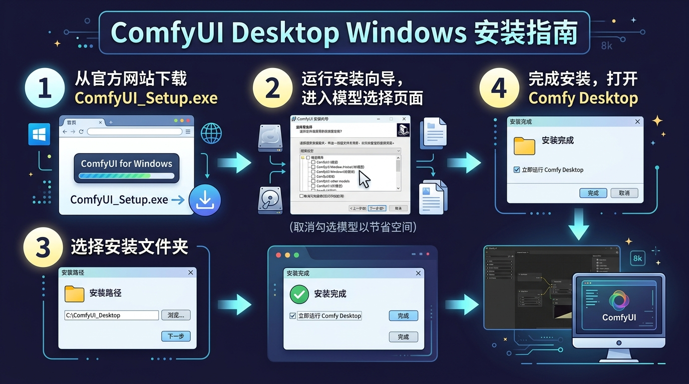

# 00. ComfyUI Desktop 官方桌面版从下载、安装向导到启动全流程

> **零死角保姆级！** 本节手把手教你如何从官网下载安装包、避开模型下载巨坑、完成安装向导并启动软件。

---

## 📥 1. 官网下载安装包

请务必认准官方唯一下载入口：

* **官方下载网址**：[https://www.comfy.org/download](https://www.comfy.org/download)
* **安装包文件**：点击 **`Download for Windows`** 按钮，下载获取 `ComfyUI_Setup.exe` 安装程序。

---

## ⚙️ 2. 安装向导（Setup Wizard）手把手拆解

双击运行 `ComfyUI_Setup.exe`，请参考下方的 **官方安装步骤拆解全景图**：

### 📌 安装向导 4 大核心步骤：

#### 步骤 1：选择安装路径（避开 C 盘）
* **建议**：默认安装路径通常在 C 盘，建议点击 `Browse / 浏览` 按钮，修改安装到磁盘大的分区（例如：`D:\ComfyUI_Desktop`）。

#### 步骤 2：模型选择页面（Model Selection —— 避坑关键！）
* **现象**：安装向导中会弹出一个列表，让你勾选预装大模型（如 SDXL Base, SD1.5 等）。
* **📢 保姆级避坑建议**：**保持全部不勾选（全部留空）！直接点击 Next 下一步！**
* **为什么**：向导自带下载的模型极其庞大（动辄 10GB~20GB），会严重拖慢安装速度且占用系统空间。后续我们会教你如何直接挂载自己硬盘里现有的模型，完全没必要在安装时下载！

#### 步骤 3：环境初始化与完成
* 保持默认设置，点击 `Install / 安装`。
* 安装完成后，勾选 `Run ComfyUI Desktop`（运行 ComfyUI 桌面版），点击 `Finish / 完成`。

---

## 🚀 3. 启动大厅与一键进入画布

安装完成后，软件会自动弹出一个带有暗黑紫风的 **Comfy Desktop 启动大厅**：

### 💡 入口指引：
1. **无需新建实例**：软件第一次安装完后，已经为你自动生成了一个名叫 `ComfyUI-20260812` 的现成环境，**完全不需要**去点击“+ 新建实例”。
2. **直接点击启动**：在界面右下角，直接点击那个醒目的蓝色 **`▶ 启动`** 按钮！
3. 稍微等待 3~5 秒，系统就会正式加载并弹出我们的**作画画布界面**了！

---

## 🖱️ 4. 认识 ComfyUI 画布与基本操作

当成功进入画布后，你可以像操控游戏地图一样控制它：

* **平移画布**：按住鼠标左键并拖拽空白处。
* **放大/缩小**：向上或向下滑动鼠标滚轮。
* **修改文字**：鼠标左键双击节点内的英文文本框即可直接修改。
* **连线拉线**：鼠标左键按住节点边缘的彩色小圆点，拖出一条线拉到另一个相同颜色的小圆点上。

---

## 🖐️ 5. 手把手教你跑通第一张图（4 步实操指南）

跟着下方的 **实操标注大图**，用鼠标一步步点击：

### 📌 详细步骤：
1. **找到正向提示词框**：在画布左侧找到标题为 `CLIP Text Encode (Prompt)` 的大框框。
2. **双击修改文字**：双击框框内的文字，按 `Ctrl+A` 删除旧文字，粘贴：`a futuristic cyberpunk city, neon lights, 8k`。
3. **点击 Queue Prompt**：鼠标点击右侧控制面板上的大按钮 **`Queue Prompt`**（或按快捷键 `Ctrl + Enter`）。
4. **生成与保存**：观察节点四周亮起绿色边框，最后在 `Save Image` 节点中生成出第一张赛博发光城市大片！右键点击图片即可保存。
