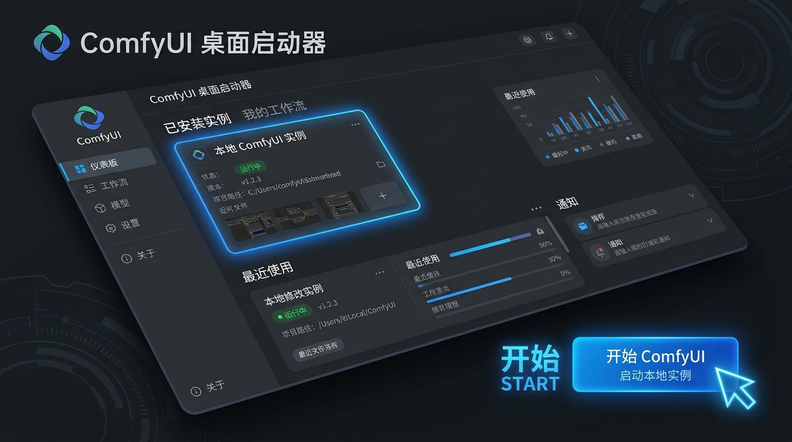
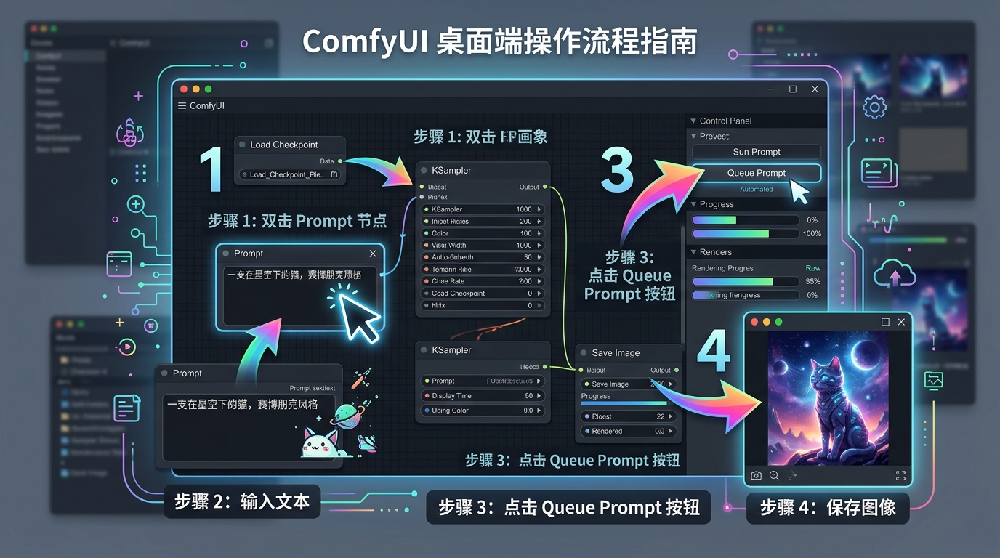

# 00. ComfyUI Desktop 官方桌面版从安装到新建实例全流程

> **真实实拍保姆级！** 本节完全契合 ComfyUI Desktop 官方最新版的安装流程，手把手教你完成安装向导、新建第一个实例并避开模型下载巨坑。

---

## ⚙️ 一、 安装向导 4 大步骤（真实安装流程）

运行下载好的 `ComfyUI_Setup.exe`，安装过程分为 4 步：

1. **安装选项**：选择 `仅为我安装`（或所有用户） ➔ 点击 **【下一步】**。
2. **选定安装位置**：建议把路径修改到磁盘大的分区（例如：`D:\Programs\Comfy Desktop`） ➔ 点击 **【安装】**。
3. **自动安装依赖**：系统会自动抽取文件并安装 `Microsoft Visual C++` 等必备运行库。
4. **完成向导**：勾选 `运行 Comfy Desktop` 和 `Add a desktop shortcut` ➔ 点击 **【完成】**。

---

## 🚨 二、 首次打开大厅：【新建实例 + 模型选择避坑】

首次全新安装成功后，打开的 **Comfy Desktop 启动大厅** 中央是空白的，只有 **`+ 新建实例`** 和 **`Comfy Cloud`** 两个卡片：

### 📌 手把手新建实例与模型避坑 3 步走：

#### 1. 点击【新建实例】
鼠标左键点击大厅左侧大大的 **`+ 新建实例`** 卡片（设置一个全新的 ComfyUI 环境）。

#### 2. 进入【配置 Comfy Desktop】界面
点击后会弹出一个名为 **配置 Comfy Desktop (你希望如何安装此版本？)** 的窗口：
* **名称**：保持默认 `ComfyUI` 即可。
* **检测到的 GPU**：会自动识别到你的 `NVIDIA` 显卡（如 RTX 5080/4070）。
* **安装位置**：默认在 C 盘。如果想保护 C 盘空间，可以点击右侧 **`浏览...`** 按钮，修改保存路径到 D 盘（如 `D:\ComfyUI-Installs`）。
* **操作**：确认后，点击右下角亮黄色的 **`继续`** 按钮！

#### 3. 进入【选择入门工作流】页面（📢 极其关键的避坑大按钮！）
* **现象**：接着会弹出一个标题为 **选择入门工作流 (模型会在安装期间下载)** 的页面，列出了 MiniMax H3 (~53GB)、Wan 2.1 (~11GB) 等推荐工作流。
* **📢 核心避坑操作**：**千万不要点击右下角的黄色【安装】按钮！请务必点击左下角的【跳过并安装】按钮！**
* **原因**：如果误点了右下角的黄色【安装】，软件就会在后台强行下载那个 53GB 的庞大模型，耗时极长且会塞爆硬盘。点击左下角的 **`跳过并安装`** 才能最纯净、最快速地完成环境配置！

#### 4. 环境解压与初始化（⌛ 关键耐心等待提示！）
* **现象**：点击“跳过并安装”后，软件会自动在后台进行 Python 嵌入环境解压、基础依赖安装和环境配置。
* **📢 新手特别提示**：根据个人网络状况与电脑配置不同，**这个解压与配置过程大约需要 3 ~ 5 分钟时间**。在此期间界面可能会有短时间的静止，**请耐心等待，千万不要误以为软件卡死而强行关闭窗口！**

#### 4. 自动直接进入画布与关闭【模板】弹窗（📢 新版最全细节！）
* **现象**：环境解压配置完成后，软件会**自动直接进入作画画布**（无需手动再在大厅点击启动），且首次会自动弹出一个黑色的 **【模板库】** 弹窗。
* **操作**：直接用鼠标点击弹窗右上角的 **`X`**（关闭按钮），关掉模板弹窗，就能展露出底部的 ComfyUI 主作画画布了！

---

## 🖱️ 三、 认识 ComfyUI 画布与加载默认节点

### 💡 极简指引：空白画布如何 1 秒载入 5 大基础节点？

由于前面我们选择了“跳过并安装”（为了节省硬盘空间），所以软件打开后是一个**完全空白的画布**。

请使用以下最简单的方法之一，**一键调出 5 大核心节点**：

#### 🌟 方法 1：使用最左侧侧边栏【模板库】载入（官方原生法）
1. 看你屏幕最左边的黑色侧边栏，点击最上方第一个图标 **【模板】**（带有网格方块的图标）。
2. 在弹出的窗口左侧菜单中，点击 **`节点基础`**（或选择 `图像` ➔ `文生图`）。
3. 点击选中的节点模版，5 大核心节点就会**瞬间全部平铺在你的画布上**了！

#### 🚀 方法 2：拖入教程专属标准工作流文件（最推荐！）
* 教程为你准备了一个标准干净的 5 大节点文件：[📥 点击下载 01-default-workflow.json](/01-default-workflow.json)
* 用鼠标按住这个文件，直接**拖进你的 ComfyUI 黑色画布**中松开，所有节点和连线就会一秒自动摆好！

---

### 🎮 画布基本操作口诀：

当节点弹出来后，你可以像操控游戏地图一样控制它：

* **平移画布**：按住鼠标左键并拖拽空白处。
* **放大/缩小**：向上或向下滑动鼠标滚轮。
* **修改文字**：鼠标左键双击节点内的英文文本框即可直接修改。
* **连线拉线**：鼠标左键按住节点边缘的彩色小圆点，拖出一条线拉到另一个相同颜色的小圆点上。

---

## 🖐️ 四、 手把手教你跑通第一张图（4 步实操指南）

请跟着下方的 **实操标注大图**，用鼠标一步步点击：

### 📌 详细步骤：
1. **找到正向提示词框**：在画布左侧找到标题为 `CLIP Text Encode (Prompt)` 的大框框。
2. **双击修改文字**：双击框框内的文字，按 `Ctrl+A` 删除旧文字，粘贴：`a futuristic cyberpunk city, neon lights, 8k`。
3. **点击【▷ 运行】按钮**：鼠标点击屏幕右上角的蓝框大按钮 **`▷ 运行`**（或按快捷键 `Ctrl + Enter`）。
   * *注意*：在新版中文界面中，作画按钮叫 **`▷ 运行`**（旧版英文叫 `Queue Prompt`）。
4. **生成与保存**：观察节点四周亮起绿色边框，最后在 `Save Image` 节点中生成出第一张赛博发光城市大片！右键点击图片即可保存。
