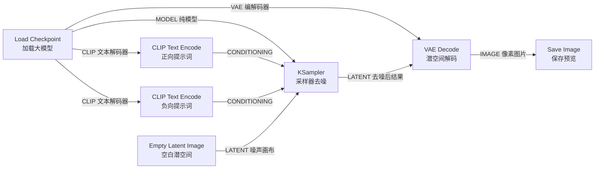

# 01. ComfyUI 5大核心节点与底层数据流解析

> **学习目标**：彻底摒弃黑盒思维，理解 ComfyUI 如何像搭积木一样，将文本转化为像素。跑通属于你的第一个“文生图”工作流。

---

## 一、 为什么选择 ComfyUI？（潜空间数据流）

传统的 WebUI（如 Automatic1111）像是一个封装好的软件界面，你点击按钮，后台自动帮你处理。而 **ComfyUI 是一个可视化数据流引擎**。

在 AI 绘图中，计算机并不是直接在像素（Pixels）上作画，而是在一个高度压缩的**潜空间（Latent Space）**中进行去噪推演。ComfyUI 把这个过程中的每一个步骤独立拆分为**“节点（Nodes）”**。

---

## 二、 通关：最基础的 5 大核心节点

一个最简化的“文生图”工作流，必须由以下 **5 个核心节点** 互相连通：

### 1. Load Checkpoint（模型加载器）
* **作用**：载入你的主模型文件（.safetensors）。
* **三大输出接口（线的颜色）**：
  * 🟣 **MODEL（紫色）**：神经网络的主干去噪模型（UNet / Transformer）。
  * 🟢 **CLIP（绿色）**：文本理解模型，负责把人类语言转成向量。
  * 🔴 **VAE（红色/粉色）**：负责在“潜空间”与“真实像素图片”之间互相转换的解码器。

### 2. CLIP Text Encode（提示词编码节点）
* **作用**：输入提示词（Prompt），由 CLIP 模型将其转化为 AI 能听懂的引导条件（Conditioning）。
* **标准配置**：通常需要 **2 个** 该节点：
  * 一个作为**正向提示词（Positive）**：想要画面出现的元素。
  * 一个作为**负向提示词（Negative）**：不想要出现的元素。

### 3. Empty Latent Image（空白潜空间节点）
* **作用**：为采样器提供一张“充满纯随机高斯噪声”的指定分辨率画布（例如：1024x1024）。
* **重要概念**：这里设置的 Width/Height 是潜空间尺寸，并不是最终渲染出来的图片尺寸（由于 VAE 8倍压缩，1024x1024 在潜空间实际只是 128x128 的向量矩阵）。

### 4. KSampler（去噪采样器 —— 核心发动机）
* **作用**：AI 绘画的核心算法引擎。它接收高斯噪声画布、提示词引导条件和模型，一步步剔除噪声（Denoise）。
* **核心参数解析**：
  * `seed`：随机种子。相同的 Seed + 相同的参数 = 100% 产生相同的图片。
  * `steps`：去噪步数（通常 20-30 步）。
  * `cfg`：提示词相关性。越大越严谨遵循提示词（一般设 7.0）。
  * `sampler_name`：采样器算法（如 `euler`, `dpmpp_2m`）。
  * `denoise`：去噪强度（1.0 代表完全重新去噪，图生图时常用小于 1.0）。

### 5. VAE Decode（VAE 解码节点）
* **作用**：将 KSampler 算好的“潜空间向量（Latent）”，翻译转换成人类眼睛看得懂的“RGB 像素图片（Image）”。
* **终点**：连接到 `Save Image` 或 `Preview Image` 节点显示结果。

---

## 三、 实战避坑连线法则

1. **同色相连**：紫色连紫色（MODEL）、绿色连绿色（CLIP）、黄色连黄色（CONDITIONING）、灰粉色连灰粉色（LATENT）、蓝色连蓝色（IMAGE）。
2. **红框报错**：如果节点变成红色高亮，说明连线断开或缺少必要的依赖模型。

---

## 四、 本课思考与练习
1. 打开你的 ComfyUI，检查默认工作流是否包含这 5 大节点。
2. 试着把 `Empty Latent Image` 的分辨率从 512x512 修改为 1024x1024，观察生成速度和画质的变化。
