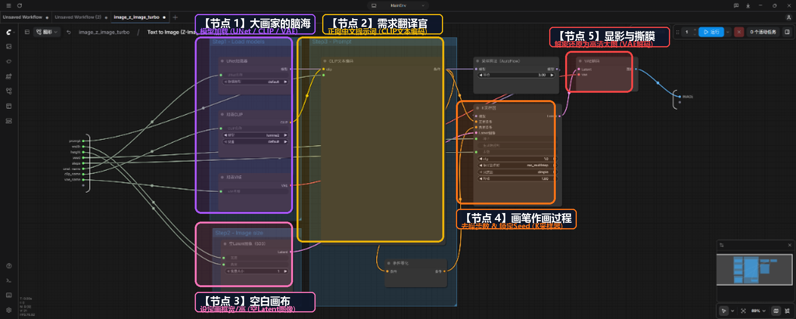
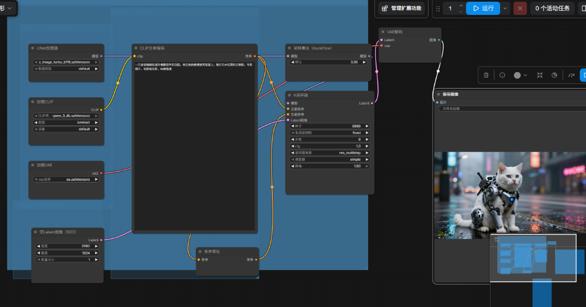

# 01. 5大核心节点与核心参数全景透视：从零拆解到 21:9 机械猫实战

> **彻底告别抽象术语与玄学抽卡！** 本节将以创作一张**【21:9 赛博朋克机械猫电影大片】**为动手主线，把 ComfyUI 的 5 大剧组角色、真机面板参数、连线法则与子图操控一网打尽！

---

::: details 🚨 动手前必读避坑：输入框是灰色的点不动？一秒拔线解锁！{open}

如果你解包进入工作流内部后，发现 `宽度`、`高度`、`种子`、`CLIP名称` 等输入框是**灰色的无法点击修改**：

* **🔍 为什么会变灰？**
  * 参数左侧的 **小绿点（Widget 端点）** 连着外接绿线时，ComfyUI 会将其锁定为“外接受控只读模式”。
* **🛠️ 1 秒解锁动作（拔掉绿线）**：
  * 用鼠标按住小绿点上的**浅绿色连线**，向左侧空白处**一拖一甩松开（断开连线）**！
  * 绿线拔掉的瞬间，输入框就会**立刻从灰色变亮**，恢复为可以自由双击打字或点击下拉菜单的正常状态！

:::

---

## 📊 双机硬件实测看板 (Benchmark)

在动手实操前，先看一下在不同硬件配置下，极速模型（Z-Image-Turbo 6B）的真实推理性能：

| 硬件平台 | 显卡配置 | 分辨率 | 步数 (Steps) | 单张生成耗时 | 峰值显存占用 | 批量 (Batch=4) 耗时 |
| :---: | :---: | :---: | :---: | :---: | :---: | :---: |
| 🚀 **旗舰性能平台** | AMD 9800X3D + **RTX 5080** | 1344 × 576 (21:9) / 1536 × 640 | 8 步 | **~1.1 秒** | ~7.8 GB | **~3.2 秒 (4张大片)** |
| ⚡ **主流甜品平台** | Intel i7-14700KF + **RTX 4070 12GB** | 1344 × 576 (21:9) / 1536 × 640 | 8 步 | **~2.7 秒** | ~7.2 GB | 建议保持 Batch=1 队列跑 |

---

## 🖼️ AI 出图的 5 步全景数据流与剧组分工

别被密密麻麻的连线吓到了，如果把 ComfyUI 想象成一个**“画画剧组”**，你就是总导演，手下有 **5 位各司其职的专业大拿（从左向右流水线协作）**：


* **1️⃣ 首席大画家（`UNet 加载器`）**：扩散模型主脑，脑子里装着顶级写实质感与艺术灵魂。
* **2️⃣ 需求翻译官（`加载CLIP` + `CLIP文本编码`）**：阿里 Qwen 3.4B 语言大脑，把中文翻译成画家指令。
* **3️⃣ 画框置景师（`空Latent图像`）**：根据导演要求裁剪画框比例（如 21:9 电影画幅），摆好空白画布。
* **4️⃣ 执笔主画手（`K 采样器` + `AuraFlow`）**：核心画笔，在空白画布上极速执行 8 轮去噪擦出画面。
* **5️⃣ 暗房显影师（`加载VAE` + `VAE解码`）**：将潜空间数学数据冲洗为高清真彩 PNG 并装裱存盘。

::: details 💡 为什么画布左侧的【Step1 蓝框】会放了 3 个加载器？
在真机画布上，你会看到左侧有一个叫 `Step1 - Load models` 的蓝色大框，里面整齐摆放着 `UNet加载器`、`加载CLIP` 和 `加载VAE`。  
这是因为在**工程实现**上，这三个节点都负责“从硬盘读取大文件到显存”；但在**剧组业务分工**上，它们分别效力于【首席大画家】、【需求翻译官】和【暗房显影师】三大不同岗位！
:::

对照下方真机全景标注图，我们逐一进入 5 位剧组专家的内部面板深入拆解：



---

## 1️⃣ 角色一：首席大画家（Diffusion Model / 扩散主脑）

位于左侧 `Step1 - Load models` 蓝色大框顶部，负责为整个工作流提供 AI 画家的核心艺术记忆与写实画风：

### 物理节点：`UNet加载器`
* **`unet_name`**：选择主扩散模型。本课使用的是 `z_image_turbo_bf16.safetensors`（6B 极速写实模型，保存在 `models/diffusion_models/` 中）。
* **`数据类型 (weight_dtype)`**：默认选 `default` 或 `bf16`（现代 RTX 40/50 系显卡原生支持 BF16 精度，计算极快且显存占用低）。
* **输出端口**：从右侧引出 **紫色 `MODEL` 连线**，一路连入执笔画手的作画中枢！

---

::: details 🎨 避坑黄金法则：同色相连，绝不乱穿线！

在 ComfyUI 的节点画布中，每个端点都有其固定的**专属颜色**。记住最核心的一条铁律：
**“紫接紫、黄接黄、粉接粉、红接红、蓝接蓝，同色相连，绝不乱穿！”**

| 端点颜色 | 接口类型 (Type) | 白话剧组角色 | 允许连接的目标 (必须同色互连) |
| :---: | :---: | :---: | :---: |
| 🟣 **紫色** | `MODEL` | **首席大画家记忆**（扩散模型） | ➔ 只能连入采样器的 `model` 接口 |
| 🟡 **黄色** | `CONDITIONING` | **翻译官指令**（提示词） | ➔ 只能连入采样器的 `positive` / `negative` 接口 |
| 🌸 **粉色/品红** | `LATENT` | **置景师准备的未显影画布** | ➔ `空白画布` ➔ `采样器` ➔ `VAE解码器` 的 `samples` |
| 🔴 **红色** | `VAE` | **显影师解密药水** | ➔ 模型 `vae` 输出 ➔ `VAE解码器` 的 `vae` 接口 |
| 🔵 **蓝色** | `IMAGE` | **人眼可见高清大图** | ➔ `VAE解码器` 输出 ➔ `保存图像/预览图像` 节点 |

🚨 **如果节点周围出现一圈【红色高亮边框】？**  
说明该节点断线悬空、乱穿线或模型文件不存在，顺着同色连线排查即可 10 秒解决！

:::

---

## 2️⃣ 角色二：需求翻译官（Text Encoder / CLIP 语言中枢）

负责将总导演（用户）的文字意图，转化为画家听得懂的数学条件指令：

### 1. 物理节点 A：`加载CLIP`（语言大脑装载器）
* **物理位置**：位于 `Step1 - Load models` 蓝色大框正中间。
* **`类型 (type)`**：选 `lumina2`（基于 Qwen 大模型打造的国产前沿生图架构）。
* **`CLIP名称`**：若左侧连着浅绿线，**按住绿线向外一甩拔掉断开**，即可看到里面选中的正是：👉 **`qwen_3_4b`**（阿里开源通义千问 3.4B 大语言模型）！
* **💡 为什么以前必须用英文，而现在能直接打中文？**：
  * **老一代 AI (SD 1.5 / SDXL)**：使用的是 OpenAI 纯英文训练的 `CLIP-L` 语言模型，输入中文会乱码，逼着大家背英文词；
  * **新一代国产旗舰 (Z-Image-Turbo / Lumina 2)**：直接把 **通义千问 (Qwen 3.4B)** 搬来作为文本编码大脑！它原生深度理解中文成语、复杂句式、镜头景别、写实光影与物理材质，**无需任何翻译，直接打最细腻的中文即可一键精准出图**！

### 2. 物理节点 B：`CLIP 文本编码`（人类指令打字框）
* **物理位置**：位于中央 `Step3 - Prompt` 区域。
* **动手实操**：点击黑色大框内部，按 `Ctrl + A` 全选清空，替换填入以下带有电影写实质感的中文提示词：

```text
一只身穿精细机械外骨骼铠甲的白猫，坐在雨后赛博朋克街道上，路灯与水坑霓虹灯倒影，写实照片，电影级光影，8k解像度
```

### 3. 物理节点 C：`条件零化 (ConditioningZeroOut)`（负向条件静音器）
* **物理位置**：位于 `Step3` 提示词框正下方。
* **❓ 为什么这个节点点进去没有任何参数可以修改？（新手必知！）**：
  * **它是一个全自动的“数学清零管道”**：就像数学公式 $f(x) = 0$ 一样，它的唯一功能就是把左边输入的提示词张量**全部数学归零**并从右边输出给采样器；
  * **无需任何人工作业**：“清零”是 100% 确定的操作（不存在清零 50% 的概念），因此该节点**天生没有设计任何输入框或下拉菜单**，你完全不需要修改它，放着它安静工作即可！
* **💡 为什么不直接拔掉连线悬空，而一定要插这个节点？**：
  * 如果你把 K 采样器的 `负面条件` 接口拔掉悬空不接线，ComfyUI 会直接亮起**红色报错边框**（提示必填接口缺失！）；
  * 因此，`条件零化` 节点扮演了**“硬件静音塞 / 虚拟占位符”**的角色：
    * 👉 **对外**：优雅满足了采样器“必须接线”的程序语法规则；
    * 👉 **对内**：输送纯零信号，让显卡完全省去计算负向词的开销，全速出图！

---

## 3️⃣ 角色三：画框置景师（Empty Latent Image 画布规格）

在画布左下角 `Step2 - Image size` 区域，负责按照导演要求设定画板的物理尺寸与并发策略：

### 1. 宽与高（电影画幅与比例调校）
* **动手实操**：
  1. 若 `宽度` / `高度` 左侧连着浅绿线，**按住绿线向外一甩拔掉断开**；
  2. 双击数字，将 `宽度` 改为 **`1344`**，`高度` 改为 **`576`**（或 `1536 × 640`），打破默认的正方形构图！

::: details 📐 工业级避坑：为什么 AI 绘图分辨率必须是 64 的倍数？主流画幅速查表

在 AI 生成中，**分辨率千万不能随意输入奇数或非 64 整除的数字**：
* **原理**：VAE 解码器在潜空间中进行 **8 倍降采样**，而现代 DiT 架构又以 **$2 \times 2$ 的 Patch** 为计算单元，必须同时满足 $8 \times 8 = 64$ 的整除倍数，否则画面边缘极易出现色斑断层或报错！

| 影视画幅 | 严谨比例 | 推荐标准分辨率 (64的整数倍) | 适用场景与视觉感受 |
| :---: | :---: | :---: | :---: |
| 🎬 **正统 21:9 宽屏** | **$2.33:1$** | **`1344 × 576`** ($64 \times 21 : 64 \times 9$) | 严格等比 21:9，带鱼屏满屏震撼视野 |
| 🎥 **好莱坞宽银幕** | **$2.39:1$** | **`1536 × 640`** ($64 \times 24 : 64 \times 10$) | CinemaScope 院线级变形宽银幕电影感 |
| 📺 **标准 16:9 横屏** | **$1.78:1$** | **`1344 × 768`** / **`1024 × 576`** | 常用 B 站、YouTube 与电视横屏标准 |
| 📱 **竖屏 9:16 短视频** | **$0.56:1$** | **`768 × 1344`** / **`576 × 1024`** | 抖音、TikTok、视频号短视频 |
| 🔲 **正方形 1:1 头像** | **$1.00:1$** | **`1024 × 1024`** | 社交头像与主体特写展示 |

:::

### 2. 批量大小 (`batch_size`)：并发一锅出 vs 队列排队跑
* **机制对比**：`批量大小` 是显卡同时并发画多张（速度极快但显存成倍暴涨）；右上角的 `任务队列` 是一张接一张排队跑（显存完全不变，零风险）。
* **硬件建议**：旗舰卡 (RTX 5080/4090) 跑 Turbo 时可设为 `2` 或 `4` 极速出图；主流卡 (RTX 4070 12GB) 建议保持 `1`。

::: details 🚨 避坑核心：为什么视频时代严禁调大【批量大小】？{open}

* **静态图**：画 1 张图显卡只计算 **1 帧**画面（显存仅占 7~10GB），批量设为 4 时显存翻倍（14~16GB），5080/4090 还能吃得消。
* **AI 视频 (Wan 2.2)**：一条 5 秒 @ 24fps 的视频，是由 **121 帧（121 张连续大图）+ 时序运动** 组成的巨大张量！当 `批量大小 = 1` 时，显卡已经在同时计算这 121 帧，显存已满载（12GB~15GB）。
* **若把批量改成 2**：等于命令显卡**同时并发计算 2 条完整视频（$121 \times 2 = 242$ 帧）**，显存需求直接暴涨到 **30GB+**，哪怕 24GB 的 4090 也会**瞬间发生 CUDA OOM 爆显存直接崩溃黑屏**！
* 💡 **正确做法**：想批量生成多条视频，必须保持 `批量大小 = 1`，通过右上角的 **`任务队列 (Queue)` 排队逐条生成**！

:::

---

## 4️⃣ 角色四：执笔主画手（KSampler 采样器去噪核心）

在画布右侧，`K 采样器` 是全流程最核心的作画中枢，由 **主干 K 采样器面板** 与 **前置算法配件** 协同调控主画手的运笔：

### 1. 物理核心：`K 采样器 (KSampler)` 5 大核心参数透视

1. **`种子 (seed)` 与 4 种控制策略**：
   * **大白话**：Seed 是画面的**“基因灵感编号”**。只要 Seed 固定，人物长相、五官构图、机位角度与光线朝向就会 **100% 锁定不变**！
   * **策略分类**：
     * **`fixed`（固定）**：死死锁定数字。专用于**微调局部词汇、固定角色长相与多镜头一致性**。
     * **`randomize`（随机）**：每次运行自动抽奖换新数字。用于寻找全新灵感。
     * **`increment` / `decrement`**：每次运行数字自动 `+1` / `-1`。
   * **动手实操**：拔掉 `种子` 左侧绿线，填入 **`8888`**，控制菜单切换为 **`fixed`**！

2. **`步数 (steps)`：主画手的雕琢轮数（只能设置 8 步吗？为什么不是越大越好？）**：
   * **只能设置 8 步吗？** 绝不是！极速模型的实测推荐区间为：👉 **`4 ~ 12 步`**：
     * **`4 步`（极速草图）**：出图仅需 **~0.6 秒**！主体与构图完整，细节略软，适合疯狂抽卡找灵感；
     * **`8 步`（👑 黄金标准）**：**速度与画质的绝对巅峰平衡点（~1.1秒）**，金属质感、毛发与光影 100% 饱满；
     * **`12 步`（质感上限）**：轻微提升暗部对比度，但耗时增加 50%，边际提升已非常微弱。
   * **盲目调大（20步以上）的严重危害**：蒸馏提纯模型在第 8 步数学上已经达到画质极值。若强行调到 50 步以上，不仅浪费数倍时间，还会导致画面出现**“过度锐化、噪点反噬、塑料感过重、五官局部崩坏发焦”**！

3. **`cfg`：画家的听话程度**：
   * 在极速流匹配/蒸馏模型中**必须死死锁定为 `1.0`**（完全依靠模型内在先验成画）；传统扩散模型通常为 6.0~8.0。

4. **`采样器 (Sampler)` 与 `调度器 (Scheduler)`：画手的“运笔技法”与“作画节奏表”**：
   * 这是许多新手点开下拉菜单时最迷茫的两个设置，其实只需记住以下分类：

#### 🖌️ 采样器 (Sampler) 4 大主流流派大拆解（运笔技法）：
* **① `res_multistep`（多步重启族 - Z-Image 官方钦定 👑）**：
  * **特点**：专为 **现代流匹配 (Flow Matching)** 量身定制的王牌！
  * **优势**：在每一步都会结合前几步的历史运动轨迹进行综合插值推算，在 4~8 步内既快又稳，彻底杜绝画质崩溃与色块断层！
* **② `euler` / `euler_ancestral`（欧拉族 - FLUX / SD3 首选 🚀）**：
  * **特点**：单步直线切线推进，运笔最轻快利落，计算开销最小，与高度蒸馏模型天然绝配。
* **③ `dpmpp_2m` / `dpmpp_sde`（DPM 族 - SDXL 经典万金油 🎨）**：
  * **特点**：传统扩散时代（SD 1.5 / SDXL）的二阶细节之王，慢工出细活，适合 25~35 步精细作画。
* **④ `ddpm` / `lcm`（经典/轻量族）**：
  * **特点**：`ddpm` 是扩散模型鼻祖算法，步数少时较粗糙；`lcm` 是轻量加速算法。

#### ⏱️ 调度器 (Scheduler) 3 大节奏表大拆解（去噪计划表）：
* **① `simple`（线性匀速 ⭐ - 现代流匹配黄金搭档）**：
  * **特点**：匀速、等步长消除噪点。因为现代流匹配（Z-Image、FLUX、Wan 2.2）在数学上沿着一条平直的速度场推进，因此匀速线性的 `simple` 完美贴合其物理本性。
* **② `karras`（非线性曲线 🔍 - SDXL 细节之王）**：
  * **特点**：前期大步流星快速勾轮廓，后期放慢脚步精修皮肤纹理与毛孔发丝。
* **③ `beta` / `sgm_uniform`**：
  * **特点**：针对特定架构（如 FLUX Dev 或 SD3.5）强化高光对比度与暗部细节。

#### 🎯 闭眼抄作业黄金公式（绝不踩坑）：
* **⚡ 现代极速流匹配阵营 (Z-Image-Turbo / FLUX / Wan 2.2)**：
  👉 采样器选 **`res_multistep`** 或 **`euler`**，调度器**死死锁定 `simple`**！
* **🏛️ 经典传统扩散阵营 (SDXL / SD 1.5)**：
  👉 采样器选 **`dpmpp_2m`**，调度器选 **`karras`**！
* ❌ **切忌乱搭**：不要给极速流匹配模型套用复杂的 `karras` 或高阶求解器，否则极易导致画面过曝、过度锐化或噪点残留。

5. **`降噪 (denoise)`**：`1.00` 代表 100% 从零开始全新作画（文生图）；若设为 `0.30~0.70` 则为垫图重绘（图生图）。

---

### 2. 前置算法配件：`采样算法 (AuraFlow)`（精力前置分配器）
* **物理位置**：插在 UNet 与 K 采样器之间的紫色连线上。
* **💡 既然刚才讲了步数只有 8 步，那 `移位 (Shift 3.00)` 到底在干嘛？**：
  * **画家的两阶段作画规律**：AI 画画可以分为两个阶段：**【前半段：画大轮廓骨架】** 与 **【后半段：雕琢毛发/光影/材质细节】**。
  * **为什么极速模型需要移位？**：普通传统模型有 30 步，时间充裕；而 Z-Image-Turbo 极速模型一共只有刚才设定的 **8 步**！如果时间均匀分配，很容易导致“前几步大轮廓还没画扎实，就匆匆进入后半段”，最终画面结构发虚崩坏。
  * **`Shift 3.00` 的作用**：就像一个**【精力前置分配器】**，它强制模型把更多的计算算力集中在**前 1~3 步光速锁定机械猫的铠甲主体骨架**，从而让后半段步数可以全力打磨 8K 级金属反光与雨夜光影！

#### 🎛️ 实战参数对比：`Shift = 1.0` vs `3.0` vs `6.0` 到底有什么视觉区别？

| `Shift` 参数 | 算力倾斜策略 | 最终出图的视觉效果差异 | 摄影师比喻与适用画风 |
| :---: | :--- | :--- | :--- |
| **`1.00`**<br>(平缓基准) | **算力均匀平摊**<br>(骨架与细节五五开) | • 画面风格偏向**柔和、平滑、平淡**；<br>• 在 8 步极速下，宏观构图略显松散，机械铠甲边缘不够锋利硬朗。 | 🌸 **柔光人像摄影师**<br>(唯美插画、水彩、柔光人像) |
| **`3.00`**<br>(👑 **官方黄金标准**) | **适度前置倾斜**<br>(前 3 步速定骨架，后 5 步精雕材质) | • **结构硬朗度与光影细腻度的黄金平衡点**；<br>• 机械猫的铠甲外骨骼立体扎实，水坑霓虹倒影与毛发质感层次最饱满自然！ | 🎬 **好莱坞电影摄影师**<br>(8K 写实大片、科幻赛博、写实商业片) |
| **`6.00`**<br>(极度硬朗偏执) | **极度前置倾斜**<br>(前 1~2 步暴力定死骨架，后 6 步疯狂雕琢细节) | • **线条极度锐利硬朗、高光与暗部反差拉满**；<br>• 金属铠甲反光刺眼强烈，带有粗砺的硬核工业感；<br>• ⚠️ **代价**：柔和的中间调会减少，画面显得略微过硬、对比度过高。 | 🦾 **硬核重金属/废土摄影师**<br>(重型装甲机甲、暗黑废土、强烈强光硬影) |
| **`99.00`**<br>(❌ 畸变爆死) | **算力在第 1 瞬间全部耗尽** | • 导致完全没有算力去消除噪点，直接产出**抽象花屏与噪点未收敛崩坏的马赛克色块**！ | ❌ **严禁设置** |

* 💡 **一句话选型口诀**：想要**最自然逼真的写实大片**选 **`3.00`**；想要**线条刀削般锋利的暗黑硬核机甲**选 **`6.00`**！

---

## 5️⃣ 角色五：暗房显影师（VAE 解码与成片落地）

在画布最右侧，负责最后的色彩显影还原与物理落地保存：

### 1. 物理节点 A：`加载VAE`（显影工具包装载器）
* 位于 `Step1` 蓝框底部，负责加载 `ae.safetensors` 编解码模型文件，从右侧输出 **红色 `VAE` 连线** 直接连入显影机！

### 2. 物理节点 B：`VAE 解码`（冲洗显影机）
* 将潜空间抽象数学矩阵，解密还原成**人类肉眼看得懂的真彩色 RGB 像素**。

### 3. 成品展示与物理落盘位置说明
* **🔍 为什么在真机全景图中没看到独立的【保存图像】节点？**
  * 在当前的官方极速模板中，为了界面美观，`VAE 解码` 出来的图像蓝线直接连到了子图外框的输出端点，**直接在外层大卡片上实时渲染显示**；
  * 如果在普通的标准工作流中，最后通常会显式挂接一个叫 **`保存图像 (Save Image)`** 或 **`预览图像 (Preview Image)`** 的物理节点；
  * **💾 自动存盘铁律**：无论画布上是否挂接独立保存节点，ComfyUI 每次运行生成的全部图片与视频，都会自动按日期持久化存放在硬盘的：  
    👉 **`D:\ComfyUI-Installs\MainEnv\ComfyUI\output\`** 目录中！

---

## 📸 本课最终实操成果大片

按照上述 5 步流程调整好参数后，点击屏幕右上角的 **`▷ 运行`** 按钮，见证这张震撼的 21:9 机械白猫大片瞬间渲染完成：



---

## 🕹️ 核心进阶技能：黑盒卡片 vs 白盒内部（子图进出操作）

在日常使用中，官方会将这 5 大节点打包进一个 **子图 (Subgraph)** 大卡片中：

1. **👉 进入内部透视（下钻/解包）**：点击大卡片右上角的小方块扩展图标 **`[↗]`**（或**双击鼠标左键**），即可瞬间钻进内部查看 5 大节点！
2. **👈 返回上级视图（收起子图）**：看屏幕左上方导航栏，点击带左拐箭头的面包屑按钮 **`↶ image_z_image_turbo`**，即可随时退回最清爽的外层合体大卡片！

---

## 📋 主流模型黄金参数速查表

| 模型架构 | 代表模型 | 推荐步数 (Steps) | 推荐 CFG | 推荐采样器 / 调度器 | 负向提示词处理 |
| :---: | :---: | :---: | :---: | :---: | :---: |
| ⚡ **极速流匹配 (DiT)** | **Z-Image-Turbo** | **8 步** | **1.0** | `res_multistep` + `simple` | 接 `条件零化` (置空) |
| 🚀 **极速蒸馏 (FLUX)** | **FLUX.1 Schnell** | **4 步** | **1.0** | `euler` + `simple` | 无需负向词 |
| 🎨 **高质写实 (FLUX)** | **FLUX.1 Dev** | **20 ~ 28 步** | **1.0** | `euler` + `beta / simple` | 无需负向词 |
| 🏛️ **经典开源生态** | **SDXL 1.0** | **25 ~ 35 步** | **7.0** | `dpmpp_2m` + `karras` | 必须写负向词 (低画质等) |

---

::: details 🧭 阶段 0 完美收官，进入阶段 1 静态图核心能力！{open}

恭喜你！到这里你已经通过 5 大核心节点、面板参数透视与机械猫实战，彻底融会贯通了 ComfyUI 的**底层骨架与核心控制全流程**，完美完成了【阶段 0：真正理解 ComfyUI】的全部新手筑基！

接下来，我们将正式开启 **【阶段 1：静态图——建立视频的第一帧能力】**，手把手带你上手当前最顶级的开源旗舰大模型 **FLUX.2**，掌握多参考图与高可控图像编辑：

**👉 请点击下方进入下一课：[04. FLUX.2：文生图、图像编辑与多参考图](./04-flux-prompting.md)！**

:::
