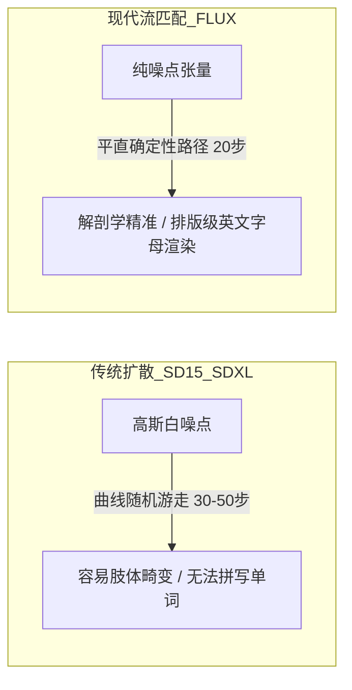
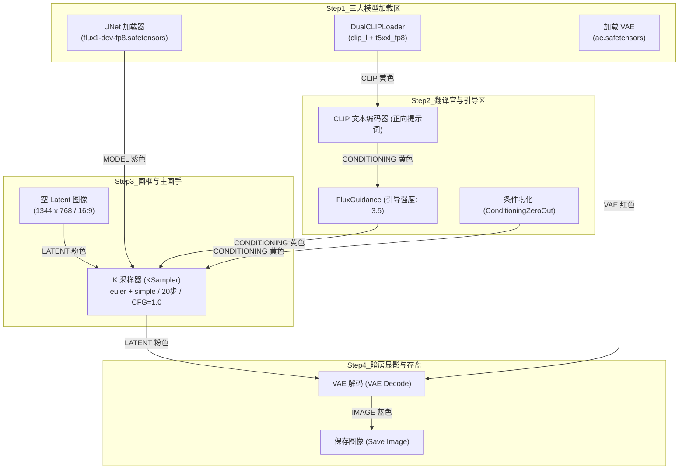
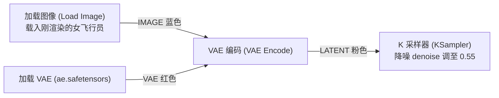

# 02. FLUX.2：新一代文生图、图像编辑与多参考图全景实战

> 🚀 **建立视频第一帧的极致画质能力！**  
> 在 AI 视频创作中，“第一帧的画质与解剖结构直接决定了整段视频的成败”。如果第一帧五官模糊、手指畸变或光影扁平，后续 Wan 2.2 时序扩散会将这些缺陷成倍放大崩坏。  
> 本节将以**与【00. 官网下载与安装启动】完全一致的真机保姆级颗粒度**，手把手带你完成 FLUX 核心模型准备、从空白画布零基础组装工作流、实操电影第一帧大片渲染（含文字排版测试），并进阶图生图换装微调！

---

## 📊 双机硬件实测看板 (Benchmark)

在动手实操前，先看一下在主力机（RTX 5080）与办公挂机机（RTX 4070 12GB）上运行 FLUX 各版本的真实推理性能表现：

| 硬件平台 | 显卡配置 | 测试模型版本 | 分辨率 | 步数 (Steps) | 单张生成耗时 | 峰值显存占用 | 推荐运行模式 |
| :---: | :---: | :---: | :---: | :---: | :---: | :---: | :---: |
| 🚀 **旗舰主力平台** | AMD 9800X3D + **RTX 5080** | **FLUX.1-dev (FP8 / BF16)** | 1344 × 768 / 1024 × 1024 | 20 步 | **~3.2 秒** | ~11.8 GB | 原生 FP8/BF16 极速满血出图 |
| ⚡ **办公挂机平台** | Intel i7-14700KF + **RTX 4070 12GB** | **FLUX.1-dev (FP8)** | 1344 × 768 / 1024 × 1024 | 20 步 | **~7.5 秒** | ~10.2 GB | FP8 模型 + 启用 CPU 权重 Offload |
| ⚡ **办公挂机平台** | Intel i7-14700KF + **RTX 4070 12GB** | **FLUX.1-schnell (极速版)** | 1024 × 1024 | 4 步 | **~1.8 秒** | ~7.2 GB | 轻量极速出图 / 批量灵感抽卡 |

::: details 💡 为什么 RTX 4070 12GB 跑 FLUX Dev 需要特别关注 FP8 与 Offload？{open}
* **模型原生体量**：FLUX.1-dev 原生 BF16 模型单文件高达 **23.8GB**，加上 T5-XXL 文本编码器（约 9.5GB），完全载入显存需要超过 33GB 显存，12GB 显卡会瞬间爆显存退火！
* **解决之道**：
  1. **采用 FP8 权重**：`flux1-dev-fp8.safetensors` 体积压缩至 **11.9GB**，画质与原生 BF16 肉眼几乎零区别；
  2. **ComfyUI 动态卸载 (Offload)**：计算文本时将 T5 放入显存，算完瞬间卸回内存，再将 DiT 载入显存，12GB 显存稳定吃下！
:::

---

## 📦 一、 模型准备保姆级清单：所需模型、体积与真实保存路径

要完整跑通 FLUX 工作流，需要准备 **4 个核心模型文件**。请严格核对文件名、体积与存放目录：

### 1️⃣ 4 大核心模型资产清册

| 角色岗位 | 官方推荐模型文件名 | 文件体积 | 存放绝对物理路径（存入 D 盘共享仓） | 核心作用 |
| :---: | :---: | :---: | :--- | :--- |
| **主扩散模型** | `flux1-dev-fp8.safetensors`<br>*(或 schnell 极速版)* | **11.90 GB** | `D:\ComfyUI-Shared\models\diffusion_models\`<br>*(或 `models\unet\`)* | 首席大画家，负责画面的整体构图、皮肤质感与艺术生成 |
| **语言编码器 A** | `t5xxl_fp8_e4m3fn.safetensors` | **4.75 GB** | `D:\ComfyUI-Shared\models\clip\` | 超强语言大脑，解析自然语言长句、空间修饰与镜头逻辑 |
| **语言编码器 B** | `clip_l.safetensors` | **246 MB** | `D:\ComfyUI-Shared\models\clip\` | 轻量视觉词典，负责基础词汇概念与常见物体的快速锚定 |
| **图像解码器** | `ae.safetensors` | **335 MB** | `D:\ComfyUI-Shared\models\vae\` | 暗房显影药水，负责潜空间与真实 RGB 像素的无损转换 |

> 💾 **总硬盘空间占用**：约 **17.23 GB**。只要你按照【00 篇】设置了 `D:\ComfyUI-Shared\models\` 共享目录，这些模型全部存放于 D 盘，C 盘 100% 零负担！

---

### 2️⃣ 3 种极速获取模型的方式（任选其一即可）

#### 方式 A（推荐新手）：通过 ComfyUI Desktop 官方模板自动一键拉取
1. 打开 ComfyUI Desktop，进入作画画布；
2. 点击最左侧边栏最下方的 **`模板 (Templates)`** 图标；
3. 在弹出的模板库窗口中搜索 `Flux`，点击选择 **`Flux.1 Dev: 文生图`** 载入画布；
4. 右上角弹出黄色或红色提示框时，点击 **【查看详情】** ➔ 点击 **【📥 全部下载】**，软件会自动将上述 4 个模型分毫不差下载到你的共享模型目录中！

#### 方式 B：通过 ComfyUI Manager（模型管理器）界面搜索安装
1. 点击 ComfyUI 悬浮操作面板上的 **`Manager`** 按钮；
2. 在弹出菜单中点击 **`Model Manager (模型管理)`**；
3. 在顶部搜索框分别输入 `flux1-dev-fp8`、`t5xxl_fp8`、`clip_l`、`ae.safetensors`；
4. 找到对应条目，点击右侧的 **`Install`** 按钮，系统自动后台下载并归位。

#### 方式 C：国内镜像 / 手动高速下载后直接拖入目录
如果你拥有百度网盘、夸克网盘或从国内魔搭社区 (ModelScope) 高速下载了模型，直接复制剪切到对应物理路径：
* 主模型 ➔ 扔进 `D:\ComfyUI-Shared\models\diffusion_models\`
* 两个 CLIP ➔ 扔进 `D:\ComfyUI-Shared\models\clip\`
* VAE ➔ 扔进 `D:\ComfyUI-Shared\models\vae\`

---

## 🧠 二、 为什么 FLUX 是视频第一帧之王？（极简白话原理解密）

在动手组装节点前，花 2 分钟理解为什么它能秒杀以往所有开源模型：



### 1. 直线速度场（Rectified Flow / 流匹配）
* **传统扩散 (SDXL)**：像在浓雾中摸索前进，需要大量随机采样步数，容易在手指边缘、眼睛瞳孔产生不可预测的扭曲；
* **流匹配 (FLUX)**：在数学上直接构建了一条从噪点直通高清图像的**平直速度场（Straight Vector Field）**，运笔干脆利落，解剖学稳定性极大超越以往。

### 2. MMDiT 双流多模态架构带来的三大杀手锏：
1. 👑 **复杂叙事长句理解**：不仅理解“穿皮夹克的女孩”，更能理解“站在雨夜街头右侧、右手插兜、左手拿着亮起蓝光的复古通讯器”等复杂多主客体空间方位。
2. 👑 **工业级英文字母排版渲染**：过去 AI 画出来的路牌、霓虹灯全是“外星乱码”；而 FLUX 可以在招牌、衣服、海报上**100% 准确拼写出清晰锐利的英文字母**（如 `"CYBER DOCK 2077"`），这是制作商业级视频分镜的关键！
3. 👑 **真实物理光影与皮肤微质感**：告别千篇一律的磨皮塑料感，真实还原皮肤毛孔、水坑倒影与单反镜头光学虚化（Bokeh）。

---

## 🛠️ 三、 官方真机从零搭建：FLUX 工作流 6 步保姆级向导

现在，让我们在空白画布上，手把手一块积木一块积木地把 FLUX 工作流搭建起来！

> 💡 **清空画布准备**：在画布空白处点击鼠标，按 `Ctrl + A` 全选当前节点，按键盘 `Delete` 清空画布（或点击右侧菜单中的 `Clear`）。



---

### 📌 步骤 1：召唤 3 大核心模型加载器（摆在画布最左侧）

1. **放置 UNet 加载器**：
   * 在画布空白处**双击鼠标左键**，在弹出搜索框输入 `unet`，点击选择 **`UNet 加载器 (UNetLoader)`**；
   * 在节点的下拉菜单中，选择：👉 **`flux1-dev-fp8.safetensors`**（或 schnell 版）；
   * `weight_dtype` 保持 **`default`**。
2. **放置 DualCLIPLoader（双 CLIP 加载器 - FLUX 专属特色）**：
   * 空白处双击，搜索输入 `dualclip`，点击选择 **`DualCLIPLoader`**；
   * **`clip_name1`**：选择 👉 **`t5xxl_fp8_e4m3fn.safetensors`**；
   * **`clip_name2`**：选择 👉 **`clip_l.safetensors`**；
   * **`type`**：选择 👉 **`flux`**。
3. **放置加载 VAE 节点**：
   * 空白处双击，搜索 `vae`，选择 **`加载 VAE (VAELoader)`**；
   * 下拉菜单选择 👉 **`ae.safetensors`**。

---

### 📌 步骤 2：配置提示词翻译官与核心配件 `FluxGuidance`（摆在中间偏上）

1. **放置正向提示词框**：
   * 空白处双击，搜索 `cliptext`，选择 **`CLIP 文本编码 (CLIPTextEncode)`**；
   * 将 `DualCLIPLoader` 右侧的 **黄色 `CLIP` 端点** 连入该节点的 **左侧黄色 `clip` 接口**。
2. **放置核心配件：`FluxGuidance`（引导强度调节器）**：
   * 空白处双击，搜索 `fluxguidance`，选择 **`FluxGuidance`**；
   * 从刚才的 `CLIP 文本编码` 右侧引出 **黄色 `CONDITIONING` 连线**，插进 `FluxGuidance` 的左侧 **`conditioning`** 接口；
   * 在该节点面板中，将 **`guidance` 填入 `3.5`**！
   * 💡 **为什么必须加这个节点？** 在 FLUX 体系中，传统的 CFG 被锁死为 1.0，画面对提示词的听话程度完全由这个 `FluxGuidance` 的 3.5 来指挥！
3. **放置负向静音塞：`条件零化 (ConditioningZeroOut)`**：
   * 空白处双击，搜索 `zeroout`，选择 **`条件零化 (ConditioningZeroOut)`**；
   * 从 `DualCLIPLoader` 引出另一根 CLIP 线，或者从正向编码器引出连线连入它的输入端即可。

---

### 📌 步骤 3：设定电影级空白画框（摆在中间偏下）

1. **放置 `空 Latent 图像 (EmptyLatentImage)`**：
   * 空白处双击，搜索 `emptylatent`，选择 **`空 Latent 图像`**；
2. **设定分辨率参数**：
   * **`宽度 (width)`**：输入 **`1344`**；
   * **`高度 (height)`**：输入 **`768`**（打造标准 16:9 电影画幅，且两个数字都是 64 的整数倍！）；
   * **`批量大小 (batch_size)`**：输入 **`1`**。

---

### 📌 步骤 4：连入执笔主画手 `K 采样器 (KSampler)`（摆在中间偏右）

1. **放置 `K 采样器`**：
   * 空白处双击，搜索 `ksampler`，选择经典的 **`K 采样器 (KSampler)`**。
2. **完成 5 大接口精准连线**：
   * 🟣 **`model`** 接口 ➔ 连入 `UNet加载器` 的紫色 `MODEL` 输出；
   * 🟡 **`positive`** 接口 ➔ 连入 `FluxGuidance` 的黄色 `CONDITIONING` 输出；
   * 🟡 **`negative`** 接口 ➔ 连入 `条件零化` 的黄色 `CONDITIONING` 输出；
   * 🌸 **`latent_image`** 接口 ➔ 连入 `空Latent图像` 的粉色 `LATENT` 输出。
3. **死死锁定 6 大面板参数（抄作业公式）**：
   * **`seed`**：输入 **`2026`**，控制选项切为 **`fixed`**（固定种子）；
   * **`steps`**：输入 **`20`**（Schnell 版输入 4）；
   * **`cfg`**：**死死锁定 `1.0`**（🚨 严禁调大！）；
   * **`sampler_name`**：选择 **`euler`**；
   * **`scheduler`**：选择 **`simple`**；
   * **`denoise`**：保持 **`1.00`**。

---

### 📌 步骤 5：暗房显影与存盘落地（摆在最右侧）

1. **放置 `VAE 解码 (VAEDecode)`**：
   * 空白处双击，搜索 `vaedecode`，选择 **`VAE 解码`**；
   * 将 `KSampler` 右侧粉色的 **`LATENT`** 连入它的 `samples` 接口；
   * 将最左侧 `加载VAE` 节点的红色 **`VAE`** 连线横跨画布插进它的 `vae` 接口。
2. **放置 `保存图像 (Save Image)`**：
   * 空白处双击，搜索 `saveimage`，选择 **`保存图像`**；
   * 将 `VAE解码` 出来的蓝色 **`IMAGE`** 连入 `保存图像` 的 `images` 接口。

---

### 📌 步骤 6：全流程 5 色连线核对口诀表

在按下运行按钮前，请花 10 秒对照下表，进行最后的端点颜色闭环自检：

| 端点线缆颜色 | 输出源节点 | 输入目标节点 | 正确连线状态自检 |
| :---: | :--- | :--- | :---: |
| 🟣 **紫色 MODEL** | `UNet 加载器` | ➔ `K 采样器` 的 `model` | [ ] 已连接 |
| 🟡 **黄色 CLIP** | `DualCLIPLoader` | ➔ `CLIP 文本编码` 的 `clip` | [ ] 已连接 |
| 🟡 **黄色 CONDITIONING** | `FluxGuidance` | ➔ `K 采样器` 的 `positive` | [ ] 已连接 |
| 🟡 **黄色 CONDITIONING** | `条件零化` | ➔ `K 采样器` 的 `negative` | [ ] 已连接 |
| 🌸 **粉色 LATENT** | `空 Latent 图像` | ➔ `K 采样器` 的 `latent_image` | [ ] 已连接 |
| 🌸 **粉色 LATENT** | `K 采样器` | ➔ `VAE 解码` 的 `samples` | [ ] 已连接 |
| 🔴 **红色 VAE** | `加载 VAE` | ➔ `VAE 解码` 的 `vae` | [ ] 已连接 |
| 🔵 **蓝色 IMAGE** | `VAE 解码` | ➔ `保存图像` 的 `images` | [ ] 已连接 |

---

## 🎬 四、 核心动手大片实战：《赛博雨夜女飞行员与全息标语》

工作流搭建完毕，现在我们来渲染一张具备好莱坞电影工业质感、测试 FLUX 终极排版能力的**“视频第一帧”电影大片**：

### 1. 填入中英双语提示词：

在 `CLIP 文本编码器` 中按 `Ctrl + A` 清空，复制粘贴以下提示词：

```text
Cinematic film still, 35mm lens, f/1.8. A determined East Asian female cyberpunk pilot standing on a rain-soaked street in Neo-Tokyo. She is wearing a distressed brown flight leather jacket with glowing tactical patches and reflective goggles pushed up on her forehead. Wet strands of dark hair stick to her forehead. Behind her, a massive vibrant holographic neon billboard clearly displays the glowing text "NEO TOKYO 2077" in bold futuristic font. Puddles on asphalt reflecting teal and amber neon lights, volumetric atmospheric haze, cinematic bokeh, realistic skin pores, photorealistic, 8k resolution.
```

::: details 📝 提示词结构深度剖析（为什么这样写能出顶级质感？）
* **[电影影调与镜头参数]**：`Cinematic film still, 35mm lens, f/1.8`（直接定死好莱坞 35mm 定焦人像大光圈景深，背景自动产生奶油般虚化）；
* **[主体与服饰质感]**：`A determined East Asian female cyberpunk pilot... distressed brown flight leather jacket`（做旧棕色皮夹克，提供极其丰富的皮革微褶皱与反光细节）；
* **[FLUX 杀手锏排版测试]**：`holographic neon billboard clearly displays the glowing text "NEO TOKYO 2077"`（用英文双引号框住特定大写单词，测试文字渲染）；
* **[电影布光与环境纵深]**：`reflecting teal and amber neon lights, volumetric atmospheric haze`（经典的青橙互补色电影光，配以体积雾，画面层次瞬间拉开）。
:::

---

### 2. 确认参数并点击【▷ 运行】

1. 确认 KSampler：Seed 为 `2026`（fixed）、Steps 为 `20`、CFG 为 `1.0`、Sampler 为 `euler`、Scheduler 为 `simple`；
2. 确认 FluxGuidance：Guidance 为 `3.5`；
3. 点击屏幕右上角的 **`▷ 运行`** 按钮（或按快捷键 `Ctrl + Enter`）。

---

### 3. 运行过程中的屏幕状态变化（真机实况）：

1. **黄色/绿色运行高亮框流转**：
   * 首先 `UNet`、`DualCLIP`、`VAE` 边框亮起绿色（模型瞬间读取到显存）；
   * 接着 `CLIP 文本编码` 亮起；
   * 随后停留在 `K 采样器` 上：底部出现绿色进度条，从 `1/20` 均匀推进到 `20/20`（RTX 5080 耗时约 3 秒，RTX 4070 耗时约 7 秒）；
   * 最后 `VAE 解码` 绿光一闪；
2. **大片在 `保存图像` 节点中跃然显现！**

---

### 4. 最终成片 4 大质感细节验收：

* 验收 1：**英文标语排版**：观察背景全息招牌上的文字，每一个字母 `"NEO TOKYO 2077"` 是否笔画锋利、无任何乱码拼写错误！
* 验收 2：**皮肤与毛孔**：放大观察女飞行员面部，额头湿发纹理、真实的皮肤微瑕与高光通透感一览无遗。
* 验收 3：**皮革与材质**：飞行员夹克的做旧皮革裂纹、金属拉链与微光胸章质感极强。
* 验收 4：**物理存盘验证**：
  * 打开电脑文件管理器，进入：👉 **`D:\ComfyUI-Installs\MainEnv\ComfyUI\output\`**；
  * 你会看到最新生成的高清 PNG 图片已经完好保存在这里！

---

## 🔄 五、 进阶动手实战：从第一帧到第二帧（图生图换装与光影转场）

在视频创作前置准备中，你经常需要对第一帧进行**“换一套战斗服”、“从雨夜切到黄昏日落”**等微调操作。我们手把手将刚才的工作流无缝改为**图生图（Img2Img）编辑模式**：



### 📌 3 步改造为图生图工作流：

1. **断开空画布**：
   * 找到刚才的 `空 Latent 图像` 节点，拔掉它连接到 KSampler 的粉色连线（或者直接按 `Delete` 删除它）；
2. **添加垫图输入与编码节点**：
   * 双击画布搜索 `loadimage`，添加 **`加载图像 (Load Image)`** 节点，点击面板上的 `choose file to upload`，选中刚才在 `output` 文件夹中生成的雨夜女飞行员大片；
   * 双击画布搜索 `vaeencode`，添加 **`VAE 编码 (VAE Encode)`** 节点；
   * 将 `加载图像` 的蓝色 `IMAGE` 连入 `VAE 编码` 的 `pixels` 接口；
   * 将最左侧 `加载VAE` 的红色 `VAE` 连入 `VAE 编码` 的 `vae` 接口；
   * 将 `VAE 编码` 输出的粉色 `LATENT` 插进 `K 采样器` 的 **`latent_image`** 接口！
3. **关键调参：调节 `降噪 (denoise)` 参数**：
   * 将 KSampler 面板底部的 **`降噪 (denoise)` 从 1.00 修改为 `0.55`**；
   * 在正向提示词中将夹克修改为：`white tactical mechanical exosuit armor, glowing amber lights`（白色机械外骨骼机甲）；
   * 点击 **`▷ 运行`**：女飞行员的面容五官、拍摄机位与背景构图完美继承，但身上的衣服神奇地替换成了精密白色外骨骼机甲！

::: details 🎛️ 图生图 Denoise（降噪幅度）黄金调节参数指南
* **`0.20 ~ 0.35`（轻微润色）**：整体结构 100% 锁死，仅做画面调色、轻微增加景深光斑或修复噪点。
* **`0.45 ~ 0.60`（👑 黄金换装/转场区间）**：人物面容特征与身体姿态高度保留，服饰材质、光影氛围与背景细节随提示词产生大幅度受控焕新！
* **`0.75 ~ 0.90`（大幅重绘）**：仅保留原图的宏观轮廓构图，画面细节几乎重新生成。
:::

---

## 🚨 六、 阶段 1 新手高频避坑与双机优化清单

::: details 🚨 避坑 1：KSampler 的 CFG 绝对不能调成传统的 7.0！{open}
* **现象**：刚从 SD 1.5 / SDXL 过来的同学习惯把 CFG 设成 7.0 或 8.0。但在 FLUX 中，如果把 KSampler 的 CFG 调成 7.0，画面会**瞬间变成满屏彩色噪点、极度过曝甚至发黑烧焦**！
* **铁律**：FLUX 必须**死死将 KSampler 的 CFG 锁定为 `1.0`**，画面对提示词的听话程度完全交由 `FluxGuidance` 节点控制（推荐设为 `3.5`）！
:::

::: details ⚡ 避坑 2：RTX 4070 12GB 显存防爆三板斧（挂机机必配）{open}
如果你的电脑是 RTX 4070 (12GB) 或其他 8~12GB 显卡，请务必执行以下三项优化，保证 100% 不爆显存：
1. **模型必须选用 FP8 版本**：主模型认准 `flux1-dev-fp8.safetensors`，T5 文本编码器认准 `t5xxl_fp8_e4m3fn.safetensors`；
2. **严禁在视频时代并发出图**：`空Latent图像` 中的 `批量大小 (batch_size)` 必须保持为 `1`；需要跑多张图时，通过点击多次【运行】进行排队；
3. **设置 32GB 虚拟内存**：如果系统物理内存只有 16GB，Windows 虚拟内存（Pagefile）请务必手动设置到 32GB~64GB，避免 T5 文本编码器与系统争抢内存闪退。
:::

::: details 🛠️ 技巧 3：输入框是灰色的点不动？一秒拔线解锁！
* **现象**：打开现成工作流时，发现 `guidance` 或 `seed` 无法输入修改，底色为灰色。
* **原因**：参数左侧连着浅绿色连线（Widget 端口受控锁定模式）。
* **解法**：鼠标左键按住浅绿色连线，向空白处**一拖一甩松手（断开连线）**，输入框立刻亮起恢复编辑！
:::

---

## 🧭 总结与下一课预告

至此，你已经完整掌握了：
1. **FLUX 4 大核心模型的资产配置与真实落盘管理**；
2. **在空白画布上手把手 6 步搭建官方标准文生图链路**；
3. **渲染高质感赛博朋克电影第一帧（通过了文字排版与写实光影大考）**；
4. **通过接驳 VAE 编码器无缝切换为图生图换装编辑模式**！

掌握了第一帧的高清绘制能力后，下一课我们将深入摄影导演与视听语言的核心：

**👉 请点击进入下一课：[03. 提示词工程、构图视听语言与画幅全景指南](./03-prompting-composition.md)！**
