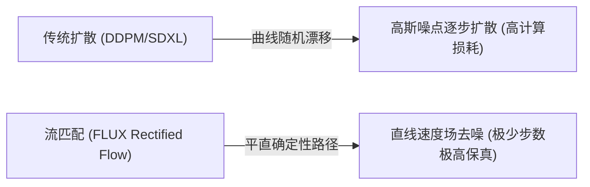
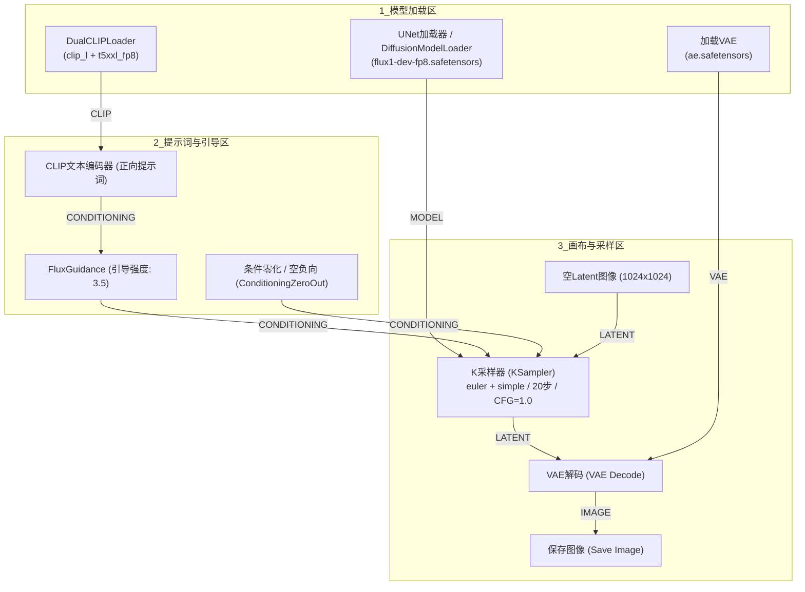

# 02. FLUX.2：新一代文生图、图像编辑与多参考图全景实战

> 🚀 **建立视频第一帧的极致画质能力！** 在 AI 视频创作中，“第一帧的画质与结构直接决定了视频生成的成败”。本节将全面拆解新一代基于流匹配（Flow Matching）与 DiT 架构的 FLUX 体系，掌握从高精度文生图、FluxGuidance 调校、Redux 多参考图引导到图生图编辑的全套工业级工作流。

---

## 📊 双机硬件实测看板 (Benchmark)

在动手实操前，先看一下在主力渲染机（RTX 5080）与办公挂机机（RTX 4070 12GB）上运行 FLUX 各版本的真实推理性能表现：

| 硬件平台 | 显卡配置 | 测试模型版本 | 分辨率 | 步数 (Steps) | 单张生成耗时 | 峰值显存占用 | 推荐运行模式 |
| :---: | :---: | :---: | :---: | :---: | :---: | :---: | :---: |
| 🚀 **旗舰性能平台** | AMD 9800X3D + **RTX 5080** | **FLUX.2 / FLUX.1-dev (BF16/FP8)** | 1024 × 1024 | 20 步 | **~3.5 秒** | ~11.8 GB | 原生 BF16 / FP8 满血极速跑 |
| ⚡ **主流甜品平台** | Intel i7-14700KF + **RTX 4070 12GB** | **FLUX.1-dev (FP8 / GGUF Q8_0)** | 1024 × 1024 | 20 步 | **~7.8 秒** | ~10.4 GB | FP8 模型 + 启用 CPU 权重 Offload |
| ⚡ **主流甜品平台** | Intel i7-14700KF + **RTX 4070 12GB** | **FLUX.1-schnell / Klein (4B)** | 1024 × 1024 | 4 ~ 8 步 | **~2.1 秒** | ~7.2 GB | 轻量极速出图 / 批量灵感探索 |

::: details 💡 为什么 RTX 4070 12GB 跑 FLUX Dev 需要关注量化与 Offload？{open}
* **模型体量**：FLUX.1-dev 原生 BF16 模型约 **23.8GB**，加上 T5-XXL 文本编码器（约 9.5GB），如果不做优化，载入显存需要超过 30GB！
* **解决方案**：
  1. **FP8 量化版**：将权重压缩至约 11.9GB（如 `flux1-dev-fp8.safetensors`），显存需求降至 10GB~12GB；
  2. **GGUF 量化版**：通过 `ComfyUI-GGUF` 插件加载 `flux1-dev-Q4_K_M.gguf`（约 6.8GB），可在 12GB 显卡上留出充足显存进行多并发与高分辨率生成；
  3. **ComfyUI 原生 Offload**：ComfyUI 会在计算文本时将 T5 放入显存，计算完立即卸载到内存，再将 DiT 载入显存，完美实现低显存平稳运行。
:::

---

## 🧠 一、 理论透视：为什么 FLUX 成为现代高质量第一帧之王？

要驯服 FLUX，必须先理解它与传统 SD 1.5 / SDXL 的底层数学差异：



### 1. 从“随机扩散”到“直达流匹配 (Rectified Flow)”
* **传统扩散 (DDPM)**：去噪过程类似于在迷雾中随机游走，需要 30~50 步才能逐步收敛，且容易在细节处产生畸变；
* **流匹配 (Rectified Flow)**：在数学上构建了一条从纯噪点直达清晰图像的**平直速度场（Straight Paths）**，AI 沿着直线最短路径前进，仅需 20 步（甚至 4 步）就能呈现出远超以往的结构稳定性与解剖学正确性。

### 2. MMDiT 双流多模态注意力机制 (Multi-Modal DiT)
* 传统架构将文字作为“外挂条件”注入图像网络，图像特征与文本特征交互较弱；
* FLUX 采用了 **MMDiT (Multi-Modal Diffusion Transformer)** 架构，文本流与图像流拥有独立的权重分支，并在双向自注意力模块中进行深度融合交流。
* **实际效果**：
  * 👑 **复杂长句遵从度满分**：能够理解“一个戴着金丝眼镜、左手拿着复古相机、右手端着咖啡穿风衣的侦探”等复杂多主体空间关系；
  * 👑 **排版级文字渲染**：可以在海报、路牌、T恤上精准拼写出完整的英文字母与标语（如精确输出 `"CYBER CITY 2077"`），彻底告别乱码鬼画符；
  * 👑 **真实物理光影与皮肤纹理**：不再有 SDXL 常见的“过度塑料磨皮感”，呈现真实的皮肤毛孔、血管微光与自然焦外虚化。

---

## 🧱 二、 核心节点链路搭建：从零组装 FLUX 文生图工作流

FLUX 在 ComfyUI 中的标准数据流如下所示：



### 📌 关键节点配置与连线解析：

#### 1. `DualCLIPLoader`（双 CLIP 文本编码器）
* **为什么需要两个 CLIP？**
  * `clip_l.safetensors`：小而快，负责捕获短词语义与基础视觉特征；
  * `t5xxl_fp8.safetensors`（或 `t5xxl_fp16`）：拥有数十亿参数的大型语言模型 T5，负责深度解析复杂的上下文长句、空间排布与逻辑修饰词。
* **连线**：输出的 `CLIP` 接口连入 `CLIP文本编码器`。

#### 2. `FluxGuidance`（FLUX 引导强度节点）
* **物理位置**：插在正向 `CLIP文本编码器` 与 `KSampler` 的 `positive` 接口之间。
* **参数 `guidance` 的核心作用**：
  * 在 FLUX 中，KSampler 内部的 `cfg` 参数必须**死死锁定为 1.0**；
  * 画面的提示词遵从度与风格鲜明度完全由 **`FluxGuidance` 中的 `guidance` 参数** 调节！

| `guidance` 设定值 | 视觉特征表现 | 适用场景推荐 |
| :---: | :--- | :--- |
| **`1.5 ~ 2.5`** | 风格柔和自然、写实感强、光影过渡平缓、AI 自由发挥度高 | 纪实摄影、电影人像、柔和自然风光 |
| **`3.0 ~ 3.5`** ⭐ | **👑 官方黄金推荐区间**：提示词精准执行，画质与写实质感最佳平衡 | 商业影视第一帧、角色概念设计、科幻大片 |
| **`4.0 ~ 6.0`** | 提示词绝对服从、构图极度规整硬朗，但对比度可能过高 | 复杂文字排版海报、特定工业产品渲染 |

---

## 🎨 三、 实操演练：渲染影视级“电影第一帧”人物

在做视频前，我们要先渲染出一张具备顶级电影质感、景深与光影的基准帧：

### 1. 提示词实战输入：

```text
Cinematic film still, a futuristic female cyberpunk pilot standing in a neon-lit rain-slicked Tokyo street, wearing a highly detailed distressed leather aviator jacket and glowing cybernetic optical goggles, wet hair sticking to forehead, atmospheric volumetric fog, blue and orange dual lighting, reflections on puddles, shot on 35mm lens, f/1.8, shallow depth of field, photorealistic, 8k resolution
```

### 2. KSampler 参数配置：
* **`seed`**：`1024`（固定 fixed）
* **`steps`**：`20` 步
* **`cfg`**：`1.0`（严禁修改）
* **`sampler_name`**：`euler`
* **`scheduler`**：`simple`
* **`denoise`**：`1.00`

点击右上角 **`▷ 运行`**，一张充满电影胶片颗粒感、景深虚化自然、毛孔与水珠清晰可见的赛博朋克主角第一帧即刻诞生！

---

## 🔄 四、 进阶：FLUX 图像编辑与 Redux / 多参考图引导

当我们需要基于已有参考图生成风格统一的全新变体，或者进行局部特征迁移时，可以使用 **FLUX Redux** 或 **图生图编辑模式**：

### 1. 图生图（Image-to-Image）微调编辑流
如果要保留原图的构图与色调，仅修改人物服饰或光影：
1. 添加 **`加载图像 (Load Image)`** 节点，载入基准参考图；
2. 连入 **`VAE 编码 (VAE Encode)`** 节点，将像素图像转化为 Latent 潜空间张量；
3. 将 Latent 输入 `KSampler` 的 `latent_image` 端点；
4. 将 `KSampler` 的 **`降噪 (denoise)`** 调整为 **`0.45 ~ 0.65`**：
   * `denoise = 0.3`：轻微调整光影色调，整体结构几乎完全不变；
   * `denoise = 0.5`：保留大体姿态构图，重新生成衣服材质与背景细节；
   * `denoise = 0.8`：大幅度重新创作，仅保留微弱轮廓提示。

### 2. FLUX Redux 多参考图特征注入 (Style & Character Injection)
* **原理**：FLUX Redux 利用视觉特征提取器（SigLIP / CLIP Vision），直接提取参考图片的全局艺术风格、色彩倾向与主体特征向量，与文字提示词共同混合注入 DiT 主干。
* **效果**：无需训练任何 LoRA，即可直接参考 1~2 张现有图片的高级光影与角色调性！

---

## 🛠️ 五、 课后实操与避坑总结

::: details 🚨 FLUX 实战避坑必看清单{open}
1. **KSampler 的 CFG 为什么千万不能调成 7.0？**
   * FLUX 属于流匹配模型，依靠 `FluxGuidance` 节点调节引导度。如果把 KSampler 内部的 `cfg` 调到大于 1.0（如传统的 7.0），画面会瞬间被过度计算摧毁，产生刺眼的噪点雪花或严重发焦发白！
2. **显存不足爆退 (CUDA OOM) 怎么办？**
   * 优先在 ComfyUI Manager 中安装 `ComfyUI-GGUF` 节点库，下载 `flux1-dev-Q4_K_M.gguf` 或 `flux1-dev-fp8.safetensors`；
   * 启动参数加入 `--lowvram`；
   * T5 文本编码器选用 `t5xxl_fp8_e4m3fn.safetensors`（占用从 9.5GB 骤降至 4.7GB）。
:::
