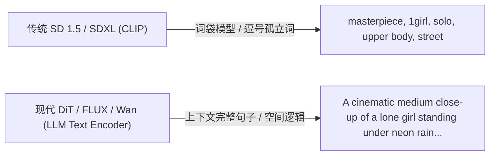
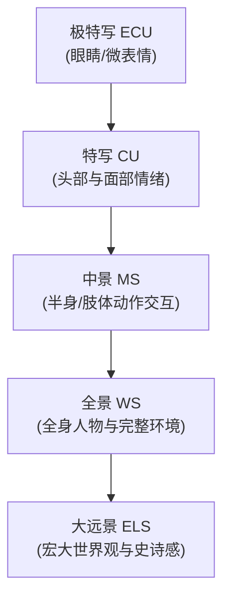

# 03. 提示词工程、构图视听语言与画幅全景指南

> 🎬 **从画匠走向摄影总监与导演！** 在生成 AI 视频第一帧时，提示词不仅是“让 AI 画出什么”，更是“如何控制镜头、光影、景别与情绪”。本节将带你彻底告别老旧的 Tag 堆砌，掌握现代大语言模型驱动的自然语言提示词工程、好莱坞级电影镜头视听语言与画幅构图法则。

---

## 📊 双机硬件实测看板 (Benchmark)

在现代生图模型（FLUX、Z-Image、Wan 2.2）中，文本编码器从早期的轻量 CLIP-L 升级为了数十亿参数的 **T5-XXL (4.7B)** 或 **Qwen (3.4B)**。看一下不同提示词长度对文本编码阶段的性能影响：

| 文本编码器 | 提示词长度 | 主机平台 (RTX 5080) 编码耗时 | 挂机平台 (RTX 4070 12GB) 编码耗时 | 文本张量显存峰值 | 语义空间解析能力 |
| :---: | :---: | :---: | :---: | :---: | :---: |
| **CLIP-L (老一代)** | 77 Tokens (短词) | ~0.02 秒 | ~0.05 秒 | ~0.3 GB | 仅识别孤立名词，无法理解复杂空间关系 |
| **T5-XXL / Qwen 3.4B** | 100~200 字自然语言 | **~0.18 秒** | **~0.42 秒** | ~4.8 GB (FP8) | 👑 深度理解语法修饰、光影物理与镜头机位 |
| **T5-XXL / Qwen 3.4B** | 500+ 字超长段落 | **~0.35 秒** | **~0.85 秒** | ~5.2 GB (FP8) | 支持完整剧本分镜与复杂场景详尽描述 |

::: details 💡 为什么长文本编码只增加几百毫秒，但出图质量天差地别？
文本编码仅在生成的第一瞬间执行一次，将自然语言转化为几百个维度的数学张量；随后的 20 步去噪采样才是显卡算力大头。因此，**在提示词阶段多写 50 个字的电影级细节描述，几乎不增加耗时，却能让画面的光影层次和质感呈几何级数跃升！**
:::

---

## 🧠 一、 理论透视：从 Tag 堆砌到自然语言叙事

要写好现代提示词，必须理解新老模型的底层语言理解演进：



### 1. 老一代 CLIP 的局限（为什么以前必须堆 Tag）
* 老一代 SD 使用的 CLIP 是“词袋模型”，缺乏复杂的语法解析能力；
* 用户必须通过大量的加权括号（如 `(masterpiece:1.3), (best quality:1.2), 8k, photorealistic`）去暴力激活模型的特定权重区域。

### 2. 现代 DiT 模型的自然语言革命
* 现代模型（FLUX、Z-Image、Wan 2.2）引入了 **T5-XXL** 或 **Qwen** 等真正的大语言模型（LLM）作为文本大脑；
* **它能理解主谓宾与空间介词**：“坐在咖啡馆窗边的男子（主语），正凝视着窗外反射霓虹灯的水坑（宾语与动作），阳光从侧后方打亮他的发丝（光线与修饰）”；
* **Tag 堆砌的危害**：如果给现代模型输入一堆混乱的 `masterpiece, 8k, high quality`，反而会污染 LLM 的上下文注意力，导致画面风格死板、细节千篇一律。

---

## 📐 二、 影视级黄金提示词 6 段式结构公式

为了让第一帧具备最高标准的电影质感，推荐采用以下经过工业实战验证的 **6 段式黄金提示词框架**：

```text
[1. 镜头景别与机位] + [2. 主体特征与服装] + [3. 动作与微表情] + [4. 环境空间与置景] + [5. 光影与色彩氛围] + [6. 摄影器材与影调风格]
```

### 📋 6 段式拆解与实战范例：

| 模块序号 | 模块名称 | 核心作用 | 实战词汇范例 (可直接组合) |
| :---: | :--- | :--- | :--- |
| **1** | **景别与机位** | 确立导演视点与画面构图 | `Cinematic medium close-up shot, eye-level angle, centered composition` |
| **2** | **主体与服饰** | 刻画人物长相、年龄、材质细节 | `A 28-year-old East Asian female astronaut wearing a worn-out tactical spacesuit with glowing blue telemetry patches` |
| **3** | **动作与神态** | 注入故事感与情绪生命力 | `Gazing intensely into the distance with a subtle confident smirk, hand resting on her helmet visor` |
| **4** | **环境与置景** | 交代空间纵深与故事背景 | `Inside a dimly lit spacecraft cockpit, control panels displaying glowing holographic star maps, subtle floating dust particles in the air` |
| **5** | **光影与氛围** | 打造高级立体感与视觉重心 | `Dramatic rim lighting, cool cyan ambient glow from screens paired with warm amber backlight, volumetric atmospheric fog` |
| **6** | **摄影与影调** | 赋予院线级胶片画质 | `Shot on Arri Alexa 65, 50mm anamorphic prime lens, f/2.0, cinematic color grading, rich dynamic range, shallow depth of field` |

---

## 🎬 三、 导演影视镜头景别与机位速查手册

第一帧的景别选择，直接决定了后续生成视频时的运动张力：



### 1. 5 大经典影视景别速查：

* 🔍 **极特写 (Extreme Close-Up / ECU)**：
  * `Extreme close-up macro shot of eyes, detailed iris reflection, cinematic tension`
  * *适用*：紧张悬疑时刻、眼睛反光中的秘密、微小道具特写。
* 👤 **特写 (Close-Up / CU)**：
  * `Cinematic close-up portrait of the face, capturing delicate facial expressions, soft bokeh background`
  * *适用*：人物对白（S2V 配音前置帧）、情绪流露与心理刻画。
* 🧍 **中景 (Medium Shot / MS)**：
  * `Medium shot from the waist up, interacting with environment, dynamic upper body posture`
  * *适用*：人物肢体动作、对话交互、手持道具展示（视频生成的黄金万能景别）。
* 🏞️ **全景 (Wide Shot / Full Shot)**：
  * `Full-length wide shot of the character walking down the avenue, establishing spatial relationship`
  * *适用*：交代人物与场景的关系、跑动与大幅度位移动作。
* 🌌 **大远景 (Extreme Long Shot / ELS)**：
  * `Extreme long establishing shot, tiny solitary figure against a massive towering futuristic megacity`
  * *适用*：短片开篇定位镜头（Establishing Shot）、宏大史诗感。

### 2. 5 大导演摄影机机位视角：

* 👁️ **平视视线 (Eye-Level Angle)**：最真实平稳的叙事视角，拉近观众距离感。
* 🦅 **仰角/英雄视角 (Low Angle / Heroic View)**：
  * `Dramatic low-angle hero shot, looking up at the towering warrior, commanding presence`
  * *作用*：增强主角的威严、力量感与压迫感。
* 🕊️ **俯角视角 (High Angle Shot)**：
  * `High angle shot looking down, showing vulnerability and the complex maze below`
  * *作用*：表现角色的渺小、无助或展示复杂的地面几何走位。
* 🛰️ **俯瞰上帝视角 (Top-Down / Bird's Eye View)**：垂直向下 90 度俯拍，极强的几何设计感与大局观。
* 📐 **荷兰倾斜角 (Dutch Angle / Canted Angle)**：
  * `Tilted Dutch angle, uneasy and tense atmosphere, dynamic diagonal composition`
  * *作用*：打破水平平衡，制造心理不安、危机感或眩晕动态。

---

## 💡 四、 摄影布光与高级色彩氛围魔法词库

光影是画面的灵魂。没有好的光影，画面就会扁平如贴纸：

| 布光类型 | 提示词核心关键词 | 视觉特征与布光原理 |
| :---: | :--- | :--- |
| **丁达尔光束** | `Volumetric God rays, dramatic atmospheric sunlight streaming through fog` | 光线穿过空气微粒形成的清晰可见光柱，极大增强空气感与神圣感 |
| **轮廓边缘光** | `Sharp rim light, hair backlight separating subject from dark background` | 从主体后方打来的强光，勾勒出发丝与肩膀轮廓，实现人物与暗部背景的完美分离 |
| **伦勃朗光** | `Rembrandt lighting, classic triangle highlight on the shadow cheek, dramatic chiaroscuro` | 经典人像三角形高光，光影立体感极其丰富，充满古典油画戏剧性 |
| **赛博冷暖双色光** | `Teal and orange dual-tone lighting, cyan fill light with warm amber key light` | 电影工业中最耐看的互补色搭配，冷色营造空间背景，暖色凸显人物主体 |
| **黄金时刻暖光** | `Golden hour warm sunset lighting, soft long shadows, golden flare` | 日落前一小时的极柔和暖金色斜阳，浪漫唯美且皮肤极显通透 |

---

## 📏 五、 影视画幅比例与构图安全区

在 ComfyUI 中，`EmptyLatentImage` 的宽高等比直接决定了视觉构图：


### 📐 构图法则三大实战技巧：
1. **三分法则 (Rule of Thirds)**：在提示词中加入 `subject positioned on the left third of the frame, ample negative space on the right`，为后续添加字幕或视频运镜留出视觉呼吸空间。
2. **引导线构图 (Leading Lines)**：利用道路、走廊、霓虹灯带向画面中心收缩（`perspective leading lines converging to infinity`），引导观众视线直达主体。
3. **景深与虚化控制 (Depth of Field)**：
   * 大光圈虚化：`Shallow depth of field, sharp focus on eyes, creamy background bokeh`
   * 深景深全清晰：`Deep depth of field, f/11 aperture, crisp focus throughout foreground and background`

---

## 🛡️ 六、 负向提示词的演进与真相

::: details 💡 为什么在 FLUX 和 Z-Image 中不再需要几百字的负面词？{open}
* **传统 SD 时代**：由于模型训练集包含大量低质噪点图，必须在负面词中写入 `bad hands, missing fingers, blurry, ugly, lowres, watermark` 来强行压制缺陷。
* **现代 DiT 时代 (FLUX / Z-Image / Wan 2.2)**：
  * 数据集经过极高质量的高清微调与清洗，模型天生不会主动生成“水印”或“马赛克”；
  * 正向文本编码能力极强，完全能够根据正向描述构建正确物理规律；
  * **结论**：在现代流匹配工作流中，负向接口通常直接挂接 **`ConditioningZeroOut`（条件零化）** 即可，无需浪费时间编写冗长的负面词！
:::
