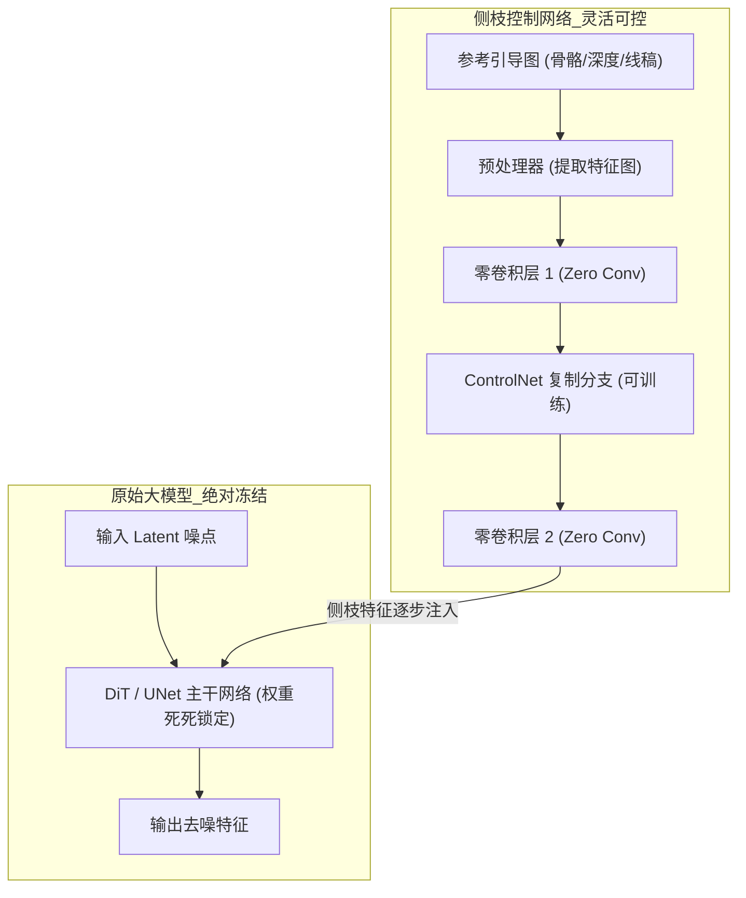
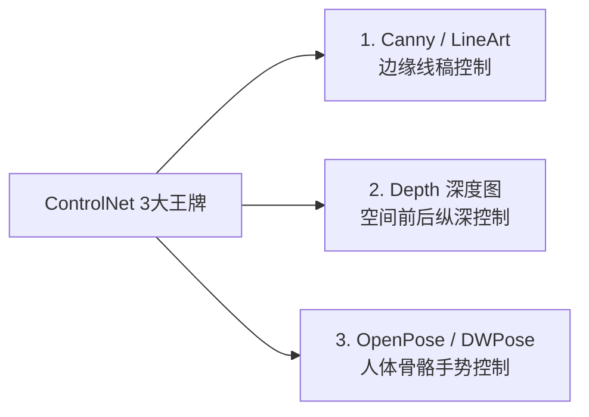

# 04. ControlNet 结构控制：从随机抽卡走向绝对精准控制

> 🎯 **从“听天由命抽卡”走向“工业级精准导演”！** 即使提示词写得再完美，纯文字也无法精确指定人物抬手的具体角度或建筑物的精确透视。本节将全面拆解 ControlNet 的底层机制，实战掌握 Canny 线条、Depth 深度、OpenPose 人体姿态三大王牌控制流与黄金调参法则。

---

## 📊 双机硬件实测看板 (Benchmark)

ControlNet 会在主扩散模型旁边并行运行一个轻量级侧枝网络。看一下在开启不同 ControlNet 时的显存开销与耗时变化：

| 硬件平台 | 显卡配置 | 基础生图模型 + ControlNet 类型 | 分辨率 | 步数 (Steps) | 生成耗时 | 峰值显存占用 | 显存增量评估 |
| :---: | :---: | :---: | :---: | :---: | :---: | :---: | :---: |
| 🚀 **旗舰性能平台** | **RTX 5080** | FLUX.1-dev + Union ControlNet (Depth) | 1024 × 1024 | 20 步 | **~4.8 秒** | ~13.2 GB | 显存微增约 1.4GB，极速流畅 |
| ⚡ **主流甜品平台** | **RTX 4070 12GB** | FLUX.1-dev (FP8) + ControlNet (Pose) | 1024 × 1024 | 20 步 | **~9.6 秒** | ~11.5 GB | 建议使用 FP8 ControlNet 模型 |
| ⚡ **主流甜品平台** | **RTX 4070 12GB** | SDXL 1.0 + ControlNet (Canny) | 1024 × 1024 | 25 步 | **~4.2 秒** | ~8.6 GB | 显存压力极小，极其丝滑 |

::: details 💡 为什么 ControlNet 会略微增加显存和耗时？
ControlNet 的侧枝网络需要与主模型在每一步去噪中进行特征张量交互。在 RTX 4070 12GB 上跑 FLUX + ControlNet 时，推荐使用官方量化版 ControlNet 或启用 CPU Offloading 机制，确保总显存维持在 11GB 以内。
:::

---

## 🧠 一、 理论透视：ControlNet 为什么能锁住结构却不破坏画质？

在 ControlNet 诞生之前，如果想控制结构，只能用传统的图生图（Img2Img）垫图，但这会导致画面风格与细节被原图锁死。ControlNet 的伟大之处在于发明了 **“锁住主干 + 零卷积侧枝注入”** 机制：



### 1. 零卷积 (Zero Convolution) 的精妙之处
* **初始状态完全无害**：零卷积层的权重和偏置在初始状态下全为 0。这意味着在训练或接入初期，它向主干网络输出的值为 0，**完全不会破坏原模型原汁原味的顶级画质与画风**；
* **逐步学习空间约束**：随着去噪推进，侧枝网络将线条、深度或骨骼坐标编码为空间引导信号，精准“推着”主干网络在指定像素位置生成对应的物体轮廓。

### 2. 为什么 ControlNet 连在 CONDITIONING 黄线上？
* 在 ComfyUI 的剧组分工中，ControlNet 属于**“空间条件指令”**；
* 它接收正向提示词（文本条件），将空间特征图与文本张量进行空间维度上的张量拼接（Conditioning Concat），随后打包输送给 KSampler。

---

## 🧱 二、 核心节点链路与标准数据流

在 ComfyUI 中接入 ControlNet 的标准节点链路如下所示：

```mermaid
graph TD
    subgraph 1_图像与预处理
        IMG["加载图像 (Load Image)<br>参考图 / 姿态图"]
        PRE["ControlNet 预处理器<br>(Canny / DWPose / Depth Anything)"]
    end

    subgraph 2_模型与控制应用
        CN_LOAD["ControlNet 加载器 (ControlNetLoader)<br>加载对应 .safetensors 模型"]
        APPLY["应用 ControlNet (Apply ControlNet)<br>strength: 0.75 | end_percent: 0.80"]
    end

    subgraph 3_主干链路
        PROMPT["CLIP 文本编码器 (正向提示词)"]
        KSAMPLER["K 采样器 (KSampler)"]
    end

    IMG --> PRE
    PRE -->|IMAGE 预处理特征图| APPLY
    CN_LOAD -->|CONTROL_NET| APPLY
    PROMPT -->|CONDITIONING| APPLY
    APPLY -->|CONDITIONING (注入空间结构)| KSAMPLER
```

---

## 🎯 三、 3 大王牌控制类型实战拆解



### 1. Canny / LineArt（线条与边缘控制）
* **工作机制**：通过高低阈值算法检测图像中明暗交界处的边缘线条；
* **适用场景**：
  * 🎨 **线稿/草图快速上色**：将手绘线稿或建筑设计图一键渲染为 8K 写实照片；
  * 📐 **工业产品与硬表面固定**：固定汽车、相机、家具等工业制品的几何边缘不变。
* **核心参数**：
  * `low_threshold`（低阈值，通常 100）：控制微弱线条的捕获量；
  * `high_threshold`（高阈值，通常 200）：滤除杂乱噪点，保留主要轮廓。

### 2. Depth（空间深度图控制）
* **工作机制**：使用 `Depth Anything` 算法预测单张图片的 3D 深度信息，输出一张“近处白、远处黑”的灰度深度图；
* **适用场景**：
  * 🌊 **空间纵深与前后景分离**：保持复杂街道、森林、走廊的空间透视；
  * 🎬 **为视频运镜打底**：后续做 3D 摄像机推进时，Depth 能够确保空间几何绝不崩塌变形。

### 3. OpenPose / DWPose（人体骨骼与手势控制）
* **工作机制**：通过关键点检测算法识别人物身体 18 个骨骼关节点、面部 68 个五官点以及手部 21 个指节；
* **适用场景**：
  * 🧍 **精确指定人物动作**：奔跑、跳跃、格斗、坐在椅子上的特定姿势；
  * 🖐️ **手势修正**：通过清晰的手部骨骼引导，彻底根除“多指、断指”等 AI 画手难题。

---

## 🎛️ 四、 关键调参黄金法则：既保骨架又保真实质感

很多新手使用 ControlNet 时，经常遇到画面死板、发灰、像“硬贴了一张皮”的问题，核心在于没有掌握以下两大黄金法则：

### 1. 控制强度 (`strength`) 黄金区间
* **`strength = 1.0`**（容易过度僵硬）：画面会死死贴合参考图线条，失去 AI 生成的自然过渡与光影丰富度；
* **`strength = 0.65 ~ 0.85`**（👑 **黄金推荐值**）：既能 100% 锁定人物姿态与建筑骨架，又能让扩散模型充分发挥写实质感与自然光影渲染！

### 2. 提前退出机制 (`end_percent`)：高级炼丹秘诀

::: details 💡 为什么将 end_percent 设置为 0.80 能让画质暴增？{open}
* **AI 绘图的两阶段规律**：
  * **前 70% 步数**：决定画面的宏观骨架、空间透视与主体位置；
  * **后 30% 步数**：决定皮肤毛孔、发丝光泽、材质高光与微观质感。
* **调参技巧**：
  * 将 `start_percent` 设为 **`0.0`**（从第 1 步介入，确保骨架正确）；
  * 将 `end_percent` 设为 **`0.75 ~ 0.85`**（在第 75% 步时让 ControlNet 提前收工退出！）；
* **惊艳效果**：在最后几步，大模型完全摆脱了外部线条的硬性束缚，能够以最自然的物理规律渲染出柔和的发丝边缘、真实的光斑焦外与细腻的皮肤纹理！
:::

---

## 🎬 五、 实战演练：线稿草图生成电影级机械战士

1. **载入一张人物姿态线稿** 到 `Load Image` 节点；
2. 接入 `Apply ControlNet` 节点，选择对应的 `flux_union_controlnet.safetensors`；
3. 设置参数：`strength = 0.75`，`start_percent = 0.0`，`end_percent = 0.80`；
4. 正向提示词输入：
   ```text
   Cinematic full body shot of a cybernetic armored warrior standing in a ruined battlefield, detailed metallic plating, glowing orange reactor core on chest, smoke and embers swirling in the air, cinematic dramatic lighting, 8k resolution, photorealistic
   ```
5. 点击运行，原本简陋的线稿瞬间蜕变为光影与金属质感满分的顶级电影概念海报！
