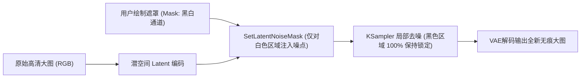
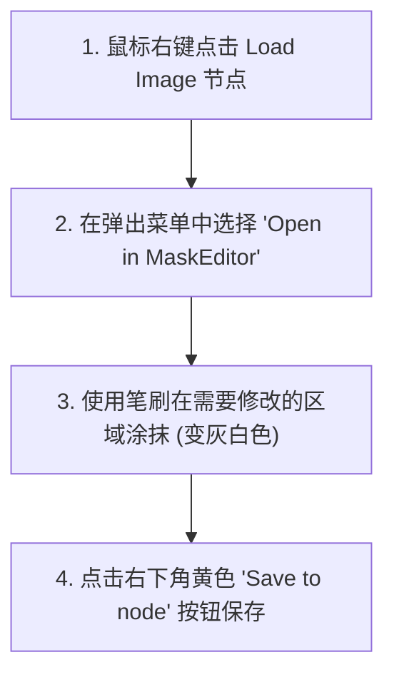
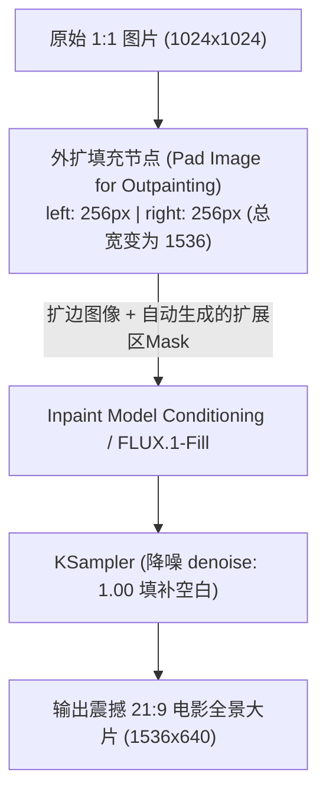

# 05. 局部重绘与画面外扩：Inpaint & Outpaint 像素级精修

> 🛠️ **修画面而不是重新抽卡！** 在工业级 AI 视频创作流程中，好不容易生成了一张光影构图绝佳的主角第一帧，但唯独右手手指微畸变，或者画面是 1:1 正方形需要拓展为 21:9 电影宽屏。本节将深入拆解局部重绘（Inpaint）与画面外扩（Outpaint）的像素级控制手法。

---

## 📊 双机硬件实测看板 (Benchmark)

在进行局部精修与扩图时，看一下在主力渲染机（RTX 5080）与挂机机（RTX 4070 12GB）上的真实运行性能对比：

| 硬件平台 | 显卡配置 | 测试任务与模型 | 分辨率 (原图 ➔ 目标) | 步数 (Steps) | 单次精修耗时 | 峰值显存占用 | 推荐场景 |
| :---: | :---: | :---: | :---: | :---: | :---: | :---: | :---: |
| 🚀 **旗舰性能平台** | **RTX 5080** | **FLUX.1-Fill-dev** (原生填充) | 1024×1024 ➔ 1536×640 | 20 步 | **~4.2 秒** | ~12.6 GB | 👑 商业级无痕修手/修脸/21:9扩图 |
| ⚡ **主流甜品平台** | **RTX 4070 12GB** | **FLUX.1-Fill-dev** (FP8 量化) | 1024×1024 ➔ 1344×576 | 20 步 | **~8.9 秒** | ~10.8 GB | FP8 量化版挂机精修 |
| ⚡ **主流甜品平台** | **RTX 4070 12GB** | **SDXL Inpaint** 专用模型 | 1024×1024 局部重绘 | 25 步 | **~3.2 秒** | ~7.8 GB | 快速轻量级瑕疵修补 |

::: details 💡 为什么首推 FLUX.1-Fill 原生填充模型？{open}
* **传统 Inpaint 的痛点**：传统扩散模型在重绘边缘处容易出现明显的“色差拼接线”或光影不连贯问题（被称为“缝合怪”）；
* **FLUX.1-Fill 的革命性突破**：模型在训练阶段就原生融入了图像填充与遮罩通道，能够 360 度感知遮罩周围的光影方向、环境反射与纹理走向，实现**好莱坞院线级 100% 无痕融合**！
:::

---

## 🧠 一、 理论透视：局部重绘与外扩的数学本质



### 1. 遮罩 (Mask) 的数学原理
* 遮罩本质上是一张单通道的二值灰度图：
  * **黑色区域 (值为 0)**：代表**“受保护区”**，Latent 数据完全冻结，AI 严禁修改；
  * **白色区域 (值为 1)**：代表**“重绘区”**，会被重新注入随机高斯噪点，由 KSampler 重新雕琢；
  * **灰色边缘 (0~1 之间)**：代表**“过渡羽化区”**，用于消除新老像素交界处的硬切断痕迹。

---

## 🖌️ 二、 ComfyUI 内置遮罩编辑器 (Mask Editor) 极速操作

在 ComfyUI 中，你无需打开 Photoshop，直接在画布上即可完成专业级涂抹：



### ⌨️ 效率快捷键与实操技巧：
* **调整笔刷大小**：键盘快捷键 **`[`（缩小笔刷）** 与 **`]`（放大笔刷）**；
* **清除误涂区域**：按住 **`Shift` 键拖动鼠标** 即可切换为橡皮擦清除；
* **外扩与羽化利器 (`GrowMaskWithBlur` 节点)**：
  * 建议在遮罩输出后挂接一个 `GrowMaskWithBlur` 节点；
  * 设置 `expand = 8`（向外微扩 8 像素，确保包裹住瑕疵边缘）与 `blur_radius = 6`（柔和羽化 6 像素），彻底杜绝边缘硬接缝！

---

## 🛠️ 三、 手把手实操一：局部重绘（Inpaint）修手、修脸与换装

这是最常用的精修工作流，用于在不改变整体画面的前提下修复局部五官或替换衣服：

```mermaid
graph TD
    IMG["加载图像 (Load Image)<br>右键涂抹手部 Mask"]
    VAE["VAE 编码 (针对局部重绘)<br>VAE Encode (for Inpainting)"]
    MASK["遮罩羽化 (GrowMaskWithBlur)<br>expand: 8 | blur: 6"]
    KS["K 采样器 (KSampler)<br>降噪 denoise 精密调节"]
    DEC["VAE 解码 (VAE Decode)"]

    IMG -->|IMAGE| VAE
    IMG -->|MASK| MASK
    MASK -->|MASK| VAE
    VAE -->|LATENT (仅遮罩区含噪点)| KS
    KS --> DEC
```

### 🎛️ `降噪 (denoise)` 参数精密调校区间表：

| 降噪系数 (`denoise`) | AI 重构力度 | 核心适用场景 |
| :---: | :--- | :--- |
| **`0.30 ~ 0.45`** | **轻度微调**<br>(严格遵循原结构) | • 修复轻微手指歪斜、微调眼神光、去除皮肤微小痘痘与噪点；<br>• 绝不会改变脸型与五官位置。 |
| **`0.55 ~ 0.75`** ⭐ | **👑 黄金置换区间**<br>(保留光影，重构细节) | • **修手之王**：彻底重绘崩坏的手指与复杂手势；<br>• **服饰替换**：将人物的白色 T 恤替换为精细的皮夹克或西装；<br>• **发型更换**：短发变波浪卷发。 |
| **`0.85 ~ 1.00`** | **彻底抹除重建**<br>(完全不参考原区域) | • 抹除背景中的路人或杂物，凭空生成一盏复古路灯或一只机械猫。 |

---

## 🖼️ 四、 手把手实操二：画面外扩（Outpaint）扩展 21:9 电影宽银幕

很多时候，我们有一张构图绝美的 1:1 正方形人物特写，但为了制作短片视频，必须将其左右扩展为 **21:9 好莱坞宽银幕（1344×576 或 1536×640）**：



### 📌 3 步搭建 Outpaint 扩图工作流：

1. **添加 `Pad Image for Outpainting` 节点**：
   * 输入原图；
   * 设置 `left = 256`、`right = 256`（将宽度从 1024 扩展为 1536）；
   * 设置 `feathering = 16`（边缘 16 像素平滑羽化过渡）。
2. **连接 `Inpaint Model Conditioning` 节点**：
   * 将扩展后的图像和自动生成的遮罩（Mask）连入该节点，并连接正向提示词。
3. **提示词撰写秘诀**：
   * 提示词应描述**整张画面的完整全景延伸**（例如：原图是一个站在中央的赛博朋克战士，提示词应补充左右两侧延伸出的雨夜街道、高耸建筑霓虹广告牌与水坑倒影）。
4. **运行采样**：KSampler 将会在保持中间人物像素 100% 毫发无损的同时，自动在左右两侧凭空无缝绘制出与原图光影、透视 100% 契合的宽银幕背景！

---

## 💡 五、 工业级精修避坑总结

::: details 🚨 局部重绘与外扩避坑必读{open}
1. **为什么修手时手部总是糊成一团？**
   * 如果只在正方形大图上圈出极小的一个角落（如 50×50 像素的手），VAE 编码后在潜空间仅剩几个像素点，信息量严重不足。
   * **解决秘诀**：使用 `Crop to Inpaint`（切图重绘）技术：先将手部区域局部无损裁切放大到 1024×1024 进行精细重绘，完成后再自动贴回原图！
2. **重绘区域与原图有明显光影色差怎么办？**
   * 检查是否使用了 `GrowMaskWithBlur` 节点进行边缘羽化；
   * 提示词中必须包含原图的光影基调（如 `warm amber lighting, matching ambient shadows`），确保模型理解环境光照。
:::
